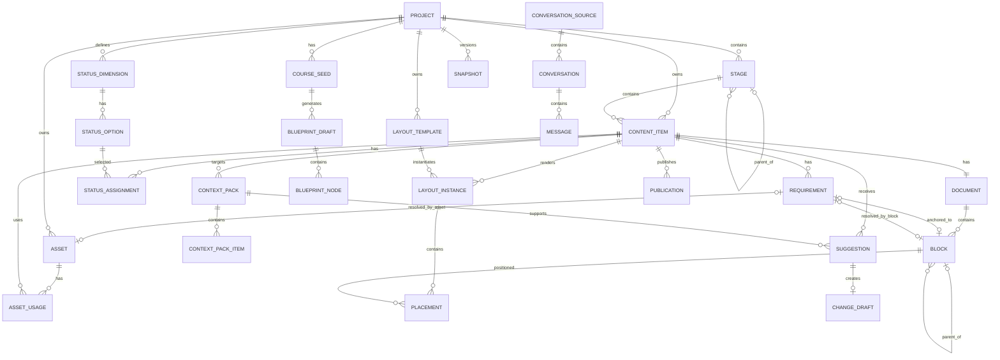

# AI Course Workbench｜对象关系图与核心数据模型

## 全局关系



---

## 核心对象

### Project

```text
id: UUID
title: String
description: Text
language: String
schema_version: String
created_at: DateTime
updated_at: DateTime
archived: Boolean
settings: JSON
```

### Stage

```text
id: UUID
project_id: FK
parent_stage_id: FK|null
code: String
title: String
description: Text
learning_action: String
order_index: Decimal
archived: Boolean
created_at: DateTime
updated_at: DateTime
```

### ContentItem

```text
id: UUID
project_id: FK
stage_id: FK|null
code: String
title: String
type: Enum
description: Text
order_index: Decimal
document_id: FK
archived: Boolean
created_at: DateTime
updated_at: DateTime
```

类型：

```text
course_overview
stage_intro
lesson
exercise
case
pitfall
assessment
summary
reference
other
```

### Document

```text
id: UUID
content_item_id: FK
schema_version: String
created_at: DateTime
updated_at: DateTime
```

### Block

```text
id: UUID
document_id: FK
parent_block_id: FK|null
type: Enum
order_index: Decimal
content: JSON|Text
settings: JSON
created_at: DateTime
updated_at: DateTime
```

类型：

```text
heading
paragraph
quote
image
gallery
gif
video
audio
table
chart
code
callout
exercise
divider
placeholder
embed
```

### Requirement

```text
id: UUID
content_item_id: FK
anchor_block_id: FK|null
type: Enum
note: Text
status: open|resolved|ignored
priority: low|normal|high
resolved_asset_id: FK|null
resolved_block_id: FK|null
created_at: DateTime
resolved_at: DateTime|null
```

类型：

```text
text
image
gif
video
audio
table
chart
quote
case
link
data
other
```

### Asset

```text
id: UUID
project_id: FK
type: Enum
filename: String
storage_path: String
mime_type: String
width: Integer|null
height: Integer|null
duration_ms: Integer|null
file_size: Integer
checksum: String
title: String
description: Text
source_type: Enum
source_url: String|null
copyright_note: Text|null
created_at: DateTime
archived: Boolean
```

### AssetUsage

```text
id: UUID
asset_id: FK
content_item_id: FK
block_id: FK|null
layout_instance_id: FK|null
role: String
created_at: DateTime
```

### StatusDimension

```text
id: UUID
project_id: FK
key: String
name: String
order_index: Decimal
allow_custom: Boolean
```

默认 key：

```text
content
media
layout
review
publish
update
```

### StatusOption

```text
id: UUID
dimension_id: FK
key: String
name: String
order_index: Decimal
is_terminal: Boolean
```

### StatusAssignment

```text
id: UUID
content_item_id: FK
dimension_id: FK
option_id: FK
updated_at: DateTime
```

约束：

```text
UNIQUE(content_item_id, dimension_id)
```

### LayoutTemplate

```text
id: UUID
project_id: FK|null
name: String
mode: flow|grid
width: Number|null
height: Number|null
aspect_ratio: String|null
default_grid: JSON
style_tokens: JSON
constraints: JSON
built_in: Boolean
```

### LayoutInstance

```text
id: UUID
content_item_id: FK
template_id: FK|null
name: String
mode: flow|grid
grid_definition: JSON
settings: JSON
created_at: DateTime
updated_at: DateTime
```

### Placement

```text
id: UUID
layout_instance_id: FK
block_id: FK
row_start: Integer
row_end: Integer
column_start: Integer
column_end: Integer
alignment: JSON
fit_mode: contain|cover|stretch|natural
padding: JSON
z_index: Integer
```

### CourseSeed

```text
id: UUID
project_id: FK|null
source_type: Enum
raw_text: Text|null
source_files: JSON
metadata: JSON
created_at: DateTime
```

类型：

```text
overview
outline
toc
articles
folder
spreadsheet
conversations
wizard
blank
```

### BlueprintDraft

```text
id: UUID
course_seed_id: FK
title: String
status: draft|confirmed|discarded
created_at: DateTime
confirmed_at: DateTime|null
```

### BlueprintNode

```text
id: UUID
blueprint_id: FK
parent_id: FK|null
node_type: stage|content
title: String
suggested_type: String
order_index: Decimal
```

### ConversationSource

```text
id: UUID
provider: String
display_name: String
connector_type: String
account_label: String
connection_status: Enum
auth_reference: String
last_sync_at: DateTime
```

### Conversation

```text
id: UUID
source_id: FK
external_id: String
title: String
external_created_at: DateTime
external_updated_at: DateTime
synced_at: DateTime
metadata: JSON
```

### Message

```text
id: UUID
conversation_id: FK
external_id: String|null
role: user|assistant|system|tool
content: Text|JSON
attachments: JSON
created_at: DateTime
```

### ContextPack

```text
id: UUID
project_id: FK
target_content_item_id: FK|null
purpose: String
created_at: DateTime
model_connection_id: FK|null
```

### ContextPackItem

```text
id: UUID
context_pack_id: FK
source_type: Enum
source_id: String
label: String
content_hash: String
order_index: Decimal
```

### Suggestion

```text
id: UUID
target_content_item_id: FK
context_pack_id: FK
type: Enum
title: String
description: Text
evidence_refs: JSON
status: pending|accepted|ignored
model_metadata: JSON
created_at: DateTime
reviewed_at: DateTime|null
```

Suggestion 类型：

```text
add_content
remove_content
rewrite
update_fact
add_media
restructure
new_lesson
move_lesson
other
```

### ChangeDraft

```text
id: UUID
suggestion_id: FK
target_content_item_id: FK
base_revision: String
proposed_changes: JSON
diff: JSON
status: draft|reviewing|applied|discarded
created_at: DateTime
applied_at: DateTime|null
```

### Snapshot

```text
id: UUID
project_id: FK
name: String
note: Text
git_commit_hash: String
created_at: DateTime
```

### Publication

```text
id: UUID
content_item_id: FK
platform: String
layout_instance_id: FK|null
status: Enum
version_label: String
published_at: DateTime|null
external_url: String|null
export_path: String|null
```

### ModelConnection

工作台本地数据：

```text
id: UUID
provider: String
name: String
base_url: String
model: String
credential_reference: String
capabilities: JSON
enabled: Boolean
```

### UserPreference

```text
id
theme
left_panel_width
right_panel_width
default_editor_mode
last_open_project
other_settings
```

---

## 删除策略

- Project / Stage / ContentItem / Asset：默认归档或废纸篓。
- Requirement：优先 `ignored`。
- Asset 被引用时禁止直接删除。
- Block 可删除，但由撤销与自动保存保护。

---

## 数据原则

1. 永久 ID 与用户编号分离。
2. 所有帖子统一使用 ContentItem。
3. 正文由 Block 组成。
4. 占位符本质是 Requirement。
5. 状态与完整度分开。
6. 内容与排版分开。
7. AI 只产生 Suggestion / ChangeDraft。
8. 总览和统计都是派生视图。
