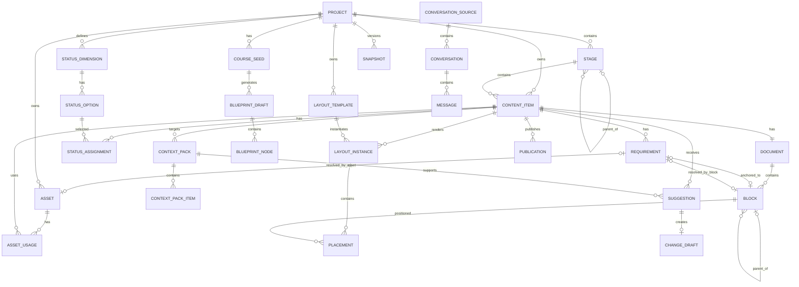

# AI Course Workbench｜完整开发规格合集

> 本文件将开发资料包中的编号 Markdown 按顺序合并，便于一次性提供给开发 AI。

> 若章节存在早期与后期细节差异，以 `00_开发AI必读_最终约束与文档优先级.md` 及编号更靠后的专题决策为准。


---

<!-- SOURCE: 00_开发AI必读_最终约束与文档优先级.md -->

# AI Course Workbench｜开发 AI 必读：最终约束与文档优先级

> 本文是整个开发资料包的入口。  
> 若早期文档与后期文档存在细节差异，以本文和编号更靠后的专题文档为准。  
> 本项目不再按 V0 / V1 / V2 拆分产品定义；所有文档共同描述同一套完整产品。

---

# 1. 产品定义

AI Course Workbench 是一个：

> **Desktop-first、Local-first、重 GUI、面向非技术用户的长期课程与内容生产工作台。**

它不是 Markdown 编辑器套壳，也不是 AI 聊天工具套壳。

核心价值：

```text
课程结构
→ 正文创作
→ 待补需求
→ 素材收集
→ 媒体管理
→ 排版
→ 预览
→ 导出 / 发布
→ 版本恢复
→ AI 辅助更新
```

所有过程尽量在一个工作台完成。

---

# 2. 最终冻结原则

1. **GUI 是用户入口，结构化数据是真实状态。**
2. **项目默认保存在本地。**
3. **技术细节不暴露给普通用户。**
4. **状态由用户决定，完整度由 Requirement 自动计算。**
5. **正文底层 Block 化，但前台采用弱 Block 感连续写作。**
6. **单课编辑器正式包含：正文 / 结构 / 排版 / 预览。**
7. **结构视图操作的是同一份 Block 数据，不复制正文。**
8. **正文决定语义顺序；Layout 只决定空间位置。**
9. **Requirement 是一等对象。**
10. **Requirement 必须区分 `scope = content | layout`。**
11. **内容级缺口和排版级缺口分开统计。**
12. **内容与排版完全分离。**
13. **Grid 使用可变 Track + 吸附，不采用任意像素自由画布。**
14. **Grid 支持 LayoutSection。**
15. **多页、长图、网页等输出由 ExportPreset 控制。**
16. **Inbox 是一级入口，用于未分类输入。**
17. **结构只维护一次，COURSE_MAP 等都是生成视图。**
18. **自动总结不调用 AI，只显示结构化状态。**
19. **AI 只产生 Suggestion / ChangeDraft，不直接修改 Canonical Data。**
20. **AI 上下文必须由用户显式勾选。**
21. **外部模型网页版 / Agent 对话通过独立 Connector 读取。**
22. **连接器读取必须由用户主动触发，不做后台隐式采集。**
23. **API Key / 网页凭据不进入项目、不进入 Git。**
24. **后台使用版本系统，前台只呈现“保存版本 / 查看 / 恢复”。**
25. **项目必须保持开放、可迁移。**
26. **用户可以非线性开发：任何时候跳到任何课程。**
27. **左右侧栏可收起，中央工作区始终优先。**
28. **所有关键操作必须可撤销或可恢复。**

---

# 3. 后期新增、已覆盖早期模型的对象

正式加入：

```text
LayoutSection
InboxItem
ExportPreset
```

Requirement 正式补充：

```text
scope: content | layout
layout_instance_id: FK|null
```

单课中央模式正式从早期：

```text
正文 / 排版 / 预览
```

调整为：

```text
正文 / 结构 / 排版 / 预览
```

---

# 4. 推荐文档阅读顺序

开发 AI 推荐按以下顺序读取：

```text
00 最终约束
01 产品定位
02 总体架构
03 核心数据模型
04 编辑器 / 占位符 / 状态 / 排版
05 AI / 连接器 / 版本
06 课程创建 / 自动生成
07 GUI 三栏
08 Desktop / Grid 交互
09 LayoutSection / 素材输入
10 启动层 / Inbox / Command Palette
11 保存 / Undo / 多标签
12 技术架构与技术选型
13 服务边界 / IPC / 事件模型
14 持久化 / 恢复 / 迁移
15 安全 / 隐私 / 权限
16 导入 / 导出 / 发布
17 测试 / 验收 / 性能
18 实施工作包 / Definition of Done
19 开发禁止偏离项
```

---

# 5. 不允许开发 AI 自行改变的核心边界

未经明确需求，不得：

- 把 Local-first 改成 Cloud-first；
- 把 JSON / Markdown 开放项目格式改成仅数据库封闭格式；
- 把 AI Suggestion 改成 AI 自动覆写；
- 把 Requirement 简化成一段 Markdown 注释；
- 把内容状态与缺口合并成一个状态；
- 把 Flow / Grid 分裂成两个互不相关编辑器；
- 把 Grid 改成 Figma 式任意像素自由画布；
- 把 COURSE_MAP.md 重新设成唯一主数据；
- 把 API Key 写入项目文件；
- 默认读取用户全部外部聊天记录；
- 删除版本恢复保护；
- 要求课程必须线性制作；
- 为每一个后台对象单独做一级页面。

---

# 6. 用户语言与内部语言

前端优先自然语言。

例如：

```text
Requirement → 待补
Snapshot → 历史版本
ContentItem → 课程 / 内容
ConversationSource → 对话来源
LayoutInstance → 排版版本
```

开发代码内部可以使用技术对象名，但不得直接泄漏到普通 UI。


---

<!-- SOURCE: 01_产品定位与设计原则.md -->

# AI Course Workbench｜产品定位与设计原则

## 产品定位

AI Course Workbench 是一个面向非技术用户的长期课程与内容生产工作台。

它不是单纯的 Markdown 编辑器，也不是只能写文章的富文本编辑器，而是同时处理：

- 课程结构管理
- 单篇内容制作
- 多媒体管理
- 占位符与内容缺口管理
- 多维制作状态
- 流式与二维排版
- 版本保存与恢复
- AI 对话与内容建议
- 外部模型 / Agent 对话记录读取
- 长期课程更新
- 多平台发布准备

核心问题不是“怎么编辑一个文件”，而是：

> 用户怎样管理一套长期、复杂、持续更新的内容工程。

---

## GUI 优先

普通用户不应该被要求理解：

- Markdown
- YAML
- JSON
- Git
- commit
- API SDK
- 文件元数据
- ContentItem
- Requirement
- AssetUsage

这些可以存在于后台，但前台只看到：

- 课程
- 阶段
- 帖子
- 正文
- 图片
- GIF
- 视频
- 当前状态
- 缺什么
- 历史版本
- AI 建议

原则：

> 底层可以高度技术化，界面尽量不出现技术。

---

## 用户可见层与真实数据层隔离

用户看到：

```text
S01-01｜AI 与搜索引擎的区别

正文：已定稿
图片：缺 2 张
GIF：缺 1 个
排版：未开始
发布：未发布
```

后台可以是结构化字段，但不要求用户直接编辑。

---

## 状态与完整度分离

状态是人为流程，例如：

```text
正文：
待研究 → 起草中 → 待审核 → 已定稿
```

完整度是系统根据未完成 Requirement 自动计算：

```text
文字缺 3 段
图片缺 2 张
GIF 缺 1 个
视频已齐
```

允许：

```text
正文：已定稿
图片：缺 2 张
```

两者不冲突。

---

## 占位符必须成为正式对象

用户写正文时突然想到：

> 这里需要一张搜索引擎结果截图。

可以直接插入：

```text
🖼 图片待补
这里加入一张搜索引擎结果截图
```

继续写。

占位符类型可以包括：

- 文字
- 图片
- GIF
- 视频
- 音频
- 表格
- 图表
- 引用
- 案例
- 链接
- 数据
- 其他

前端叫“占位符”或“待补内容”，底层使用 Requirement。

---

## 内容与排版完全分离

正文解决：

> 我要讲什么。

排版解决：

> 这些内容如何呈现。

同一份正文可以拥有：

- 微信公众号版
- 小红书版
- 网页版
- 3:4 网格版
- 4:3 网格版
- 16:9 版

---

## 多维状态而非单一状态

默认状态维度：

- 正文
- 媒体
- 排版
- 审核
- 发布
- 更新

未来允许用户增加自定义状态维度。

---

## 派生数据原则

以下内容不作为唯一真相重复保存：

- 完成率
- 缺几张图片
- 缺几段文字
- 哪些帖子待审核
- 哪些帖子待排版
- 哪些帖子需要更新
- COURSE_MAP.md
- 阶段目录
- 总页课程目录
- 状态看板
- 项目状态总结

能从真实数据重新算出来的内容，应实时生成。

---

## AI 只建议，不直接修改课程

流程：

```text
AI 分析
↓
Suggestion
↓
用户接受
↓
ChangeDraft
↓
Diff
↓
用户确认
↓
应用正文
```

禁止 AI 直接覆写 Canonical Data。

---

## AI 上下文透明

每次分析前显示：

```text
☑ 当前课程正文
☑ 当前阶段说明
☑ 课程地图
☑ 当前占位符
☑ 选中的 ChatGPT 对话
☑ 选中的 DeepSeek 对话
☐ 全部课程
☐ 全部媒体
```

只有用户勾选的内容才进入模型上下文。

---

## 自动总结不用 AI

项目状态直接由结构化数据计算：

```text
总页：已定稿

S01-00：已完成

S01-01：
正文：起草中
图片：缺 2 张
GIF：缺 1 个

S01-02：
待研究
```

支持筛选：

```text
全部
正文未完成
缺图片
缺 GIF
缺视频
待审核
待排版
待发布
需要更新
```

---

## 开放文件与可迁移

核心内容最终应可导出为：

- JSON
- Markdown
- PNG/JPG/GIF
- MP4
- 普通目录结构
- Git 仓库

即使未来工作台不存在，内容仍然可读、可迁移。

---

## Git 隐藏在 GUI 后

用户只看到：

```text
保存版本
版本名称：第一阶段正文完成
备注：补完 S01-01 至 S01-09
```

后台执行 Git 操作。

用户不需要看到 commit、branch、checkout 等概念。

---

## 恢复前自动保存当前状态

恢复旧版本前：

```text
当前状态
↓
自动创建“恢复前备份”
↓
恢复目标版本
```

---

## 项目数据与本地工作台数据分离

### 项目数据

可迁移、可 Git：

- Project
- Stage
- ContentItem
- Document
- Block
- Requirement
- Asset
- Layout
- Status
- Suggestion
- Publication
- Snapshot 元数据

### 本地数据

不进入项目：

- API Key
- 网页登录凭据
- Cookie / Token
- 本机界面布局
- 搜索索引
- 缩略图缓存
- 临时文件
- 最近打开列表

---

## 核心理念

> 结构只维护一次，所有视图自动同步。

> 想到什么可以先留下占位符，不打断创作。

> 状态由用户决定，缺口由系统计算。

> AI 只能提出建议，是否进入课程由用户决定。

> 底层可以复杂，用户操作必须简单。


---

<!-- SOURCE: 02_系统总体架构与数据分层.md -->

# AI Course Workbench｜系统总体架构与数据分层

## 四层架构

```text
┌─────────────────────────────────────────────────┐
│                   GUI 展示层                    │
│   左侧导航       中央工作区       右侧上下文栏   │
└──────────────────────┬──────────────────────────┘
                       │
┌──────────────────────▼──────────────────────────┐
│                  工作台业务层                   │
│  Course Builder   State Engine                  │
│  Document Engine  Requirement Engine            │
│  Asset Manager    Layout Engine                 │
│  View Generator   Context Builder               │
│  Version Manager  Connector System              │
└──────────────────────┬──────────────────────────┘
                       │
┌──────────────────────▼──────────────────────────┐
│                   项目数据层                    │
│  课程结构   正文   状态   占位符   媒体          │
│  排版配置   对话   更新建议   发布信息           │
└──────────────────────┬──────────────────────────┘
                       │
┌──────────────────────▼──────────────────────────┐
│                    存储层                       │
│ JSON / Markdown / Assets / Git                  │
│ + 可重建 SQLite 索引 / 缓存                     │
└─────────────────────────────────────────────────┘
```

---

## 四种数据性质

### Canonical Data

真实原始数据：

- Project
- Stage
- ContentItem
- Document
- Block
- Requirement
- Asset
- AssetUsage
- Status
- Layout
- Conversation
- Suggestion
- Publication
- Snapshot

### Derived Data

随时重新生成：

- 完成率
- 缺几张图
- 缺几段文字
- 哪些帖子待排版
- 哪些帖子需要更新
- 课程地图
- 阶段目录
- 总页目录
- 状态看板
- 媒体缺口
- 项目状态汇总

### Cache

只为性能存在：

- 全文搜索索引
- 图片缩略图
- 波形
- 视频预览图
- 课程统计
- 聊天搜索索引
- 最近查询结果

建议放在：

```text
.workspace/index.sqlite
```

### Secure Local Data

不属于项目：

- API Key
- Cookie
- Token
- 网页登录状态
- 系统钥匙串引用
- 用户界面偏好

---

## 项目目录建议

```text
AI-Course/
│
├── project.json
├── stages/
│   ├── S01.json
│   └── ...
├── contents/
│   ├── S01-00/
│   │   ├── item.json
│   │   ├── document.json
│   │   ├── content.md
│   │   └── layouts/
│   └── ...
├── assets/
│   ├── original/
│   ├── generated/
│   └── imported/
├── conversations/
├── suggestions/
├── publications/
├── exports/
├── .workspace/
│   └── index.sqlite
└── .git/
```

---

## JSON 与 Markdown 的职责

### JSON

作为 GUI 主数据：

- Block
- Requirement
- Layout
- Status
- 结构关系
- AI 建议
- 机器可读数据

### Markdown

作为开放镜像：

- 人类可读
- 跨工具迁移
- AI 输入
- 外部编辑
- 文本备份

原则：

> 结构化 JSON 是编辑器主数据，Markdown 是持续同步的开放镜像。

---

## COURSE_MAP.md

不由用户手工维护。

根据：

```text
Project
Stage
ContentItem
Status
Requirement
```

自动生成。

用途：

- AI 上下文
- 项目导出
- 人类阅读
- 课程归档
- 开发交接

---

## 自动生成机制

一个标题只存一次。

例如：

```text
S01-08
DeepSeek、豆包、ChatGPT……到底有什么区别？
```

以下位置全部读取同一份数据：

- 总页
- 阶段目录
- 左侧课程树
- 制作地图
- 发布目录
- AI Context
- 搜索结果
- 导出文件

---

## 八个后台核心 Engine

### Course Engine

负责课程结构、排序、CourseSeed、BlueprintDraft。

### Document Engine

负责 Document、Block、正文与 Markdown 镜像。

### Requirement Engine

负责占位符、缺口与完成状态。

### Asset Engine

负责媒体库、去重、引用与预览。

### Status Engine

负责多维状态与看板。

### Layout Engine

负责 Flow、Grid、模板、Placement、预览。

### AI Context Engine

负责 Conversation、ContextPack、Suggestion、ChangeDraft。

### Version Engine

负责自动保存、Git、Snapshot、恢复。

---

## 其他核心模块

### Model Connection Manager

负责 DeepSeek、豆包、ChatGPT/OpenAI、兼容接口与自定义模型。

### Conversation Connector Manager

负责 ChatGPT 网页、DeepSeek 网页、豆包网页、Claude 网页、Gemini 网页和自定义 Agent。

---

## Schema Migration

Project、Document、Layout 等都应保存 `schema_version`。

未来升级时：

```text
旧项目
↓
Migration
↓
新结构
```

不要求用户重新建项目。


---

<!-- SOURCE: 03_对象关系图与核心数据模型.md -->

# AI Course Workbench｜对象关系图与核心数据模型

## 全局关系



---

## 核心对象

### Project

```text
id: UUID
title: String
description: Text
language: String
schema_version: String
created_at: DateTime
updated_at: DateTime
archived: Boolean
settings: JSON
```

### Stage

```text
id: UUID
project_id: FK
parent_stage_id: FK|null
code: String
title: String
description: Text
learning_action: String
order_index: Decimal
archived: Boolean
created_at: DateTime
updated_at: DateTime
```

### ContentItem

```text
id: UUID
project_id: FK
stage_id: FK|null
code: String
title: String
type: Enum
description: Text
order_index: Decimal
document_id: FK
archived: Boolean
created_at: DateTime
updated_at: DateTime
```

类型：

```text
course_overview
stage_intro
lesson
exercise
case
pitfall
assessment
summary
reference
other
```

### Document

```text
id: UUID
content_item_id: FK
schema_version: String
created_at: DateTime
updated_at: DateTime
```

### Block

```text
id: UUID
document_id: FK
parent_block_id: FK|null
type: Enum
order_index: Decimal
content: JSON|Text
settings: JSON
created_at: DateTime
updated_at: DateTime
```

类型：

```text
heading
paragraph
quote
image
gallery
gif
video
audio
table
chart
code
callout
exercise
divider
placeholder
embed
```

### Requirement

```text
id: UUID
content_item_id: FK
anchor_block_id: FK|null
type: Enum
note: Text
status: open|resolved|ignored
priority: low|normal|high
resolved_asset_id: FK|null
resolved_block_id: FK|null
created_at: DateTime
resolved_at: DateTime|null
```

类型：

```text
text
image
gif
video
audio
table
chart
quote
case
link
data
other
```

### Asset

```text
id: UUID
project_id: FK
type: Enum
filename: String
storage_path: String
mime_type: String
width: Integer|null
height: Integer|null
duration_ms: Integer|null
file_size: Integer
checksum: String
title: String
description: Text
source_type: Enum
source_url: String|null
copyright_note: Text|null
created_at: DateTime
archived: Boolean
```

### AssetUsage

```text
id: UUID
asset_id: FK
content_item_id: FK
block_id: FK|null
layout_instance_id: FK|null
role: String
created_at: DateTime
```

### StatusDimension

```text
id: UUID
project_id: FK
key: String
name: String
order_index: Decimal
allow_custom: Boolean
```

默认 key：

```text
content
media
layout
review
publish
update
```

### StatusOption

```text
id: UUID
dimension_id: FK
key: String
name: String
order_index: Decimal
is_terminal: Boolean
```

### StatusAssignment

```text
id: UUID
content_item_id: FK
dimension_id: FK
option_id: FK
updated_at: DateTime
```

约束：

```text
UNIQUE(content_item_id, dimension_id)
```

### LayoutTemplate

```text
id: UUID
project_id: FK|null
name: String
mode: flow|grid
width: Number|null
height: Number|null
aspect_ratio: String|null
default_grid: JSON
style_tokens: JSON
constraints: JSON
built_in: Boolean
```

### LayoutInstance

```text
id: UUID
content_item_id: FK
template_id: FK|null
name: String
mode: flow|grid
grid_definition: JSON
settings: JSON
created_at: DateTime
updated_at: DateTime
```

### Placement

```text
id: UUID
layout_instance_id: FK
block_id: FK
row_start: Integer
row_end: Integer
column_start: Integer
column_end: Integer
alignment: JSON
fit_mode: contain|cover|stretch|natural
padding: JSON
z_index: Integer
```

### CourseSeed

```text
id: UUID
project_id: FK|null
source_type: Enum
raw_text: Text|null
source_files: JSON
metadata: JSON
created_at: DateTime
```

类型：

```text
overview
outline
toc
articles
folder
spreadsheet
conversations
wizard
blank
```

### BlueprintDraft

```text
id: UUID
course_seed_id: FK
title: String
status: draft|confirmed|discarded
created_at: DateTime
confirmed_at: DateTime|null
```

### BlueprintNode

```text
id: UUID
blueprint_id: FK
parent_id: FK|null
node_type: stage|content
title: String
suggested_type: String
order_index: Decimal
```

### ConversationSource

```text
id: UUID
provider: String
display_name: String
connector_type: String
account_label: String
connection_status: Enum
auth_reference: String
last_sync_at: DateTime
```

### Conversation

```text
id: UUID
source_id: FK
external_id: String
title: String
external_created_at: DateTime
external_updated_at: DateTime
synced_at: DateTime
metadata: JSON
```

### Message

```text
id: UUID
conversation_id: FK
external_id: String|null
role: user|assistant|system|tool
content: Text|JSON
attachments: JSON
created_at: DateTime
```

### ContextPack

```text
id: UUID
project_id: FK
target_content_item_id: FK|null
purpose: String
created_at: DateTime
model_connection_id: FK|null
```

### ContextPackItem

```text
id: UUID
context_pack_id: FK
source_type: Enum
source_id: String
label: String
content_hash: String
order_index: Decimal
```

### Suggestion

```text
id: UUID
target_content_item_id: FK
context_pack_id: FK
type: Enum
title: String
description: Text
evidence_refs: JSON
status: pending|accepted|ignored
model_metadata: JSON
created_at: DateTime
reviewed_at: DateTime|null
```

Suggestion 类型：

```text
add_content
remove_content
rewrite
update_fact
add_media
restructure
new_lesson
move_lesson
other
```

### ChangeDraft

```text
id: UUID
suggestion_id: FK
target_content_item_id: FK
base_revision: String
proposed_changes: JSON
diff: JSON
status: draft|reviewing|applied|discarded
created_at: DateTime
applied_at: DateTime|null
```

### Snapshot

```text
id: UUID
project_id: FK
name: String
note: Text
git_commit_hash: String
created_at: DateTime
```

### Publication

```text
id: UUID
content_item_id: FK
platform: String
layout_instance_id: FK|null
status: Enum
version_label: String
published_at: DateTime|null
external_url: String|null
export_path: String|null
```

### ModelConnection

工作台本地数据：

```text
id: UUID
provider: String
name: String
base_url: String
model: String
credential_reference: String
capabilities: JSON
enabled: Boolean
```

### UserPreference

```text
id
theme
left_panel_width
right_panel_width
default_editor_mode
last_open_project
other_settings
```

---

## 删除策略

- Project / Stage / ContentItem / Asset：默认归档或废纸篓。
- Requirement：优先 `ignored`。
- Asset 被引用时禁止直接删除。
- Block 可删除，但由撤销与自动保存保护。

---

## 数据原则

1. 永久 ID 与用户编号分离。
2. 所有帖子统一使用 ContentItem。
3. 正文由 Block 组成。
4. 占位符本质是 Requirement。
5. 状态与完整度分开。
6. 内容与排版分开。
7. AI 只产生 Suggestion / ChangeDraft。
8. 总览和统计都是派生视图。


---

<!-- SOURCE: 04_编辑器_占位符_媒体_状态_排版.md -->

# AI Course Workbench｜编辑器、占位符、媒体、状态与排版

## 正文编辑

正文由 Block 组成：

```text
Document
├── 标题
├── 正文
├── 图片
├── 正文
├── 占位符
├── 引用
└── 练习
```

支持拖动排序。

---

## 占位符

写作时不应因为缺素材中断。

例：

```text
🖼 图片待补
备注：这里加入一张搜索引擎结果截图

[选择素材] [去媒体库]
```

底层创建 Requirement。

占位符类型：

- 文字
- 图片
- GIF
- 视频
- 音频
- 表格
- 图表
- 引用
- 案例
- 链接
- 数据
- 其他

---

## 内容缺口自动统计

当前课程可显示：

```text
文字：缺 3 段
图片：缺 2 张
GIF：缺 1 个
视频：已齐
```

全部由 Requirement 计算。

点击右侧缺口条目，中央编辑器跳转到对应位置并显示原备注。

---

## Requirement 完成

媒体拖入占位符：

```text
open
↓
resolved
```

`resolved_asset_id` 指向 Asset。

系统自动更新缺口统计。

---

## 媒体库

统一管理：

- 图片
- GIF
- 视频
- 音频
- 文档
- 其他资源

支持：

- 拖拽上传
- 批量导入
- 标签
- 搜索
- 尺寸筛选
- 来源
- 使用位置
- 未使用素材
- 重复检测

---

## 媒体去重

使用 checksum。

发现重复时：

```text
该素材已存在
[使用已有素材]
[仍然保留副本]
```

---

## AssetUsage

媒体库显示：

```text
search-result.png

使用位置：
• S01-01 正文
• S01-01 小红书排版
• 课程总页
```

删除前检查引用。

---

## 多维状态

### 正文

```text
待研究
起草中
待审核
已定稿
```

### 媒体

```text
未开始
制作中
待审核
已完成
```

### 排版

```text
未开始
排版中
待检查
已完成
```

### 审核

```text
未审核
审核中
通过
需修改
```

### 发布

```text
未发布
待发布
已发布
```

### 更新

```text
最新
建议更新
必须更新
```

---

## 多维看板

同一批课程可切换：

- 正文状态看板
- 媒体状态看板
- 排版状态看板
- 发布状态看板
- 更新状态看板

拖动卡片修改对应状态。

---

## 状态与缺口并列

```text
S01-01

正文：已定稿
媒体：制作中
排版：未开始
发布：未发布

缺口：
图片 2
文字 1
GIF 0
视频 1
```

---

## 两种排版模式

### Flow

一维，上下流动。

适合：

- 公众号
- 网页文章
- 普通课程页
- 长文

### Grid

二维，上下左右布局。

适合：

- 海报
- 封面
- 信息图
- 3:4
- 4:3
- 16:9
- 自定义画布

---

## Flow

```text
标题
↓
正文
↓
图片
↓
正文
↓
GIF
↓
引用
↓
视频
```

---

## Grid

显示虚线：

```text
┌────┬────┬────┬────┐
│    │    │    │    │
├────┼────┼────┼────┤
│    │    │    │    │
├────┼────┼────┼────┤
│    │    │    │    │
└────┴────┴────┴────┘
```

内容块可以占一个或多个格。

---

## Grid 原则

用户不是自由拖像素坐标，而是把内容放入网格区域。

优点：

- 对齐稳定
- 间距稳定
- 边界明确
- 适合模板化

---

## 比例自适应

放入非 1:1 素材时：

```text
保持宽度 → 调整高度
```

或：

```text
保持高度 → 调整宽度
```

只改变一个维度。

---

## 网格编辑模式

正常模式：

- 虚线可见
- 不允许误拖

进入“编辑网格”后允许：

- 拖横线
- 拖竖线
- 新增线
- 删除线
- 合并区域
- 拆分区域

---

## 自动对齐

按钮：

> 对齐网格

系统根据内容边界调整 Track。

---

## 预览

点击“预览”后隐藏所有虚线，只看最终结果。

---

## 不区分封面 / 海报 / 信息图编辑器

这些本质是：

```text
尺寸 + Grid 模板 + 样式
```

新建排版时选择：

```text
公众号正文
小红书正文
3:4
4:3
16:9
1:1
A4
自定义
```

---

## 内容与排版边界

Block 不保存网格坐标。

Layout 不保存正文语义内容。

同一 Block 可在不同 Layout 中有不同 Placement。


---

<!-- SOURCE: 05_AI连接器_上下文_建议_版本.md -->

# AI Course Workbench｜AI连接器、上下文、建议与版本

## AI 的角色

AI 负责：

- 对话
- 内容分析
- 提建议
- 生成修改草稿
- 辅助创建课程地图
- 辅助发现更新点

AI 不直接修改 Canonical Data。

---

## 模型 API

统一 Model Adapter。

支持方向：

- DeepSeek
- 豆包
- ChatGPT / OpenAI
- 其他兼容接口
- 自定义 API

用户界面只显示模型连接状态。

---

## API Key 安全

API Key 不进入：

- 课程目录
- project.json
- Git
- 导出包
- 分享包

只保存 `credential_reference`。

---

## 模型网页 / Agent 聊天记录

目标支持：

- ChatGPT 网页版
- DeepSeek 网页版
- 豆包网页版
- Claude 网页版
- Gemini 网页版
- 其他 Agent 网页产品

---

## ConversationConnector

统一接口：

```text
check_login()
list_conversations()
get_conversation()
get_metadata()
sync()
```

平台实现：

```text
ChatGPTConnector
DeepSeekConnector
DoubaoConnector
ClaudeConnector
GeminiConnector
CustomConnector
```

连接器独立更新。

---

## 读取方式

按平台实际能力选择：

```text
官方 API / 官方导出
↓
浏览器扩展
↓
本地浏览器自动化
```

GUI 只显示连接状态。

---

## 用户主动勾选

读取列表不等于允许分析。

流程：

```text
读取记录
↓
用户勾选
↓
进入 Context Pack
```

例如：

```text
☐ AI新闻系统
☑ AI课程设计
☑ 工作台设计
☐ 私人聊天
```

---

## 工作台内 AI 助手

右侧可以选择：

```text
DeepSeek
豆包
ChatGPT
其他
```

上下文：

```text
☑ 当前课程正文
☑ 当前阶段
☑ 课程地图
☐ 当前媒体
☐ 所有课程
☑ 选中的历史对话
```

---

## Context Pack Builder

例如当前 S04-07：

```text
最新版课程地图
+
第四阶段说明
+
S04-07 当前正文
+
课程写作规范
+
当前 Requirement
+
用户选中的 ChatGPT 对话
+
用户选中的 DeepSeek 对话
```

每一项都应可追溯。

---

## Suggestion

AI 只生成建议：

```text
建议 #018

目标：S04-07
类型：内容补充
建议：增加 MCP 工具发现案例

依据：
ChatGPT 对话 037
DeepSeek 对话 018

[查看详情]
[接受]
[忽略]
```

---

## ChangeDraft

接受建议后：

```text
Suggestion
↓
ChangeDraft
↓
Diff
↓
确认应用
```

---

## Diff

中央显示：

```text
原文 | 修改后
```

支持：

- 全部接受
- 局部接受
- 手动修改
- 放弃

---

## Suggestion 类型

```text
add_content
remove_content
rewrite
update_fact
add_media
restructure
new_lesson
move_lesson
other
```

涉及课程结构的建议必须进入课程地图确认流程。

---

## 自动总结不用 AI

以下全部直接计算：

- 完成率
- 缺口
- 状态
- 待办
- 更新列表

---

## 自动保存

界面显示：

```text
✓ 所有修改已保存
```

---

## 保存命名版本

用户：

```text
保存版本
名称：第一阶段正文完成
备注：补完 S01-01 到 S01-09
```

后台：

```text
同步项目文件
↓
Git commit
↓
Snapshot
```

---

## 版本历史

用户看到：

```text
第一阶段正文完成
第一阶段结构冻结
初始版本
```

支持：

- 查看
- 对比
- 恢复

---

## 恢复前备份

恢复旧版本前自动创建“恢复前备份”。

---

## Git 隐藏

普通界面不出现：

- commit
- branch
- checkout
- hash

Snapshot 只是 Git 的 GUI 映射。


---

<!-- SOURCE: 06_课程创建入口与自动生成.md -->

# AI Course Workbench｜课程创建入口与自动生成机制

## 为什么要多个入口

不能要求普通用户必须提供 Markdown 或 COURSE_MAP.md。

用户更可能已有：

- 课程概论
- 大纲
- 教材目录
- 已有文章
- 文件夹
- Excel
- 聊天记录

所以创建课程应支持多个入口。

---

## 入口一：课程概论

用户说明：

- 想教什么
- 教给谁
- 学完会什么
- 范围
- 难度
- 目标

系统辅助形成 BlueprintDraft。

---

## 入口二：课程大纲

用户粘贴：

```text
第一章……
第二章……
第三章……
```

系统识别层级。

---

## 入口三：目录

适用于教材目录、章节目录、培训目录。

---

## 入口四：现有文章 / 帖子

导入已有内容后辅助分析：

- 主题聚类
- 重复
- 缺过渡
- 可组成阶段的内容
- 可作为参考资料的内容

---

## 入口五：文件夹

拖入：

- Word
- PDF
- Markdown
- TXT
- 图片
- 其他资料

扫描后生成 BlueprintDraft。

---

## 入口六：表格

例如：

| 阶段 | 课程 | 类型 |
|---|---|---|
| 入门 | AI 与搜索 | 正式课程 |
| 入门 | AI 能做什么 | 正式课程 |

直接映射课程结构。

---

## 入口七：聊天记录

用户勾选 ChatGPT、DeepSeek、豆包等对话。

工作台辅助判断这些长期讨论能否组织成课程。

---

## 入口八：向导式创建

```text
你想教什么？
↓
教给谁？
↓
学完以后应该会什么？
↓
预计几个阶段？
↓
有无已有材料？
```

---

## 入口九：空白课程

高级用户从空白项目开始。

---

## CourseSeed

所有入口统一成：

```text
CourseSeed
```

类型：

```text
overview
outline
toc
articles
folder
spreadsheet
conversations
wizard
blank
```

---

## BlueprintDraft

CourseSeed 不直接落库。

流程：

```text
CourseSeed
↓
解析
↓
BlueprintDraft
↓
课程地图确认
↓
正式 Project / Stage / ContentItem
```

---

## 课程地图确认页

用户可以：

- 拖动
- 重命名
- 新增
- 删除
- 合并
- 拆分
- 调整内容类型

点击“创建课程”后才落库。

---

## Single Source of Truth

课程标题只存一次。

以下全部读取同一对象：

- 总页
- 阶段目录
- 左侧课程树
- 制作地图
- 发布中心
- AI Context
- 搜索
- 导出

---

## 自动生成内容

### 结构类

- COURSE_MAP.md
- 阶段目录
- 总页课程清单
- 制作地图

### 状态类

- 待研究
- 起草中
- 待审核
- 已定稿
- 缺图片
- 缺 GIF
- 缺视频
- 待排版
- 待发布
- 需要更新

### 媒体类

- 未使用素材
- 缺素材课程
- 素材引用位置

### 发布类

- 已发布
- 待发布
- 平台差异

---

## 项目总结按钮

不调用 AI。

点击显示：

```text
课程总数：95

正文：
已定稿 18
起草中 7
待研究 70

媒体：
缺图片 11 篇
缺 GIF 3 篇
缺视频 2 篇

排版：
已完成 2
待排版 14

发布：
已发布 0
待发布 3

更新：
建议更新 2
```

每个状态可以进一步点击筛选。

---

## 自动生成与 AI 生成的区别

### 结构化生成，不需要 AI

- 目录
- 状态
- 缺口
- 编号
- 制作地图
- 统计

### 智能辅助，可能需要 AI

- 从概论推断阶段
- 从文章聚类
- 从聊天记录提炼课程
- 生成 BlueprintDraft

AI 生成结构必须由用户确认。


---

<!-- SOURCE: 07_GUI三栏架构与核心交互.md -->

# AI Course Workbench｜GUI三栏架构与核心交互

## 总体布局

采用：

> 左侧栏 + 中央工作区 + 右侧栏

```text
┌─────────────────────────────────────────────────────────────┐
│ 项目名称     保存版本    撤销/恢复    预览     导出          │
├───────────┬───────────────────────────────┬─────────────────┤
│ 左侧栏     │          中央工作区            │     右侧栏      │
│ 课程地图   │      正文 / 排版画布            │   媒体库        │
│ 制作看板   │                               │   占位符        │
│ 搜索       │                               │   AI助手        │
│ 更新中心   │                               │   页面属性      │
│ 发布中心   │                               │   版本历史      │
│   ◀       │                               │       ▶         │
├───────────┴───────────────────────────────┴─────────────────┤
│ S01-02｜正文已定稿｜图片缺2张｜文字缺1段｜排版未开始        │
└─────────────────────────────────────────────────────────────┘
```

---

## 左右侧栏可收起

### 专心写作

```text
中央正文
```

### 边写边找素材

```text
中央正文 + 右侧媒体库
```

### 调整结构

```text
左侧课程地图 + 中央结构视图
```

### AI 辅助

```text
中央正文 + 右侧 AI 助手
```

---

## 左侧栏职责

左侧回答：

> 我有什么？我在哪？

入口：

- 项目概览
- 课程地图
- 制作看板
- 搜索
- 更新中心
- 发布中心
- 媒体库总览
- 设置

---

## 课程地图

管理：

- Project
- Stage
- ContentItem

支持：

- 新建阶段
- 新建内容
- 拖动排序
- 跨阶段移动
- 重命名
- 修改类型
- 归档
- 搜索

---

## 制作看板

切换维度：

```text
正文
媒体
排版
审核
发布
更新
```

中央显示 Kanban。

拖动卡片修改状态。

---

## 更新中心

显示：

- 待处理建议
- 已接受建议
- 已忽略建议

来源：

- AI Suggestion
- 用户手工标记
- 外部对话分析
- 产品变化
- 事实更新需要

---

## 发布中心

显示：

- ContentItem
- 平台
- 排版版本
- 发布状态
- 发布时间
- 链接

---

## 中央工作区

主要模式：

1. 正文编辑
2. Flow 排版
3. Grid 排版
4. 看板
5. Blueprint 确认
6. AI Diff
7. 预览
8. 发布导出

---

## 正文编辑模式

操作：

- Document
- Block
- Requirement

支持：

- 写文字
- 新建标题
- 插入媒体
- 插入占位符
- 拖动 Block
- 引用
- 表格
- 图表
- 练习
- Callout

---

## Flow 排版

上下流式。

---

## Grid 排版

支持：

- 网格虚线
- 跨格
- 比例自适应
- 编辑网格
- 自动对齐
- 预览隐藏虚线

---

## Blueprint 确认

用户可以：

- 拖节点
- 新增阶段
- 新增课程
- 删除
- 合并
- 拆分
- 修改类型

---

## AI Diff

中央显示：

```text
原文 | 修改后
```

支持：

- 应用全部
- 局部接受
- 手动修改
- 放弃

---

## 右侧栏职责

右侧回答：

> 完成当前工作还需要哪些上下文？

Tab：

- 媒体
- 占位符
- 状态
- AI 助手
- 页面属性
- 版本
- 引用 / 来源

---

## 媒体库

支持：

- 搜索
- 标签
- 类型筛选
- 拖入正文
- 替换占位符
- 查看使用位置
- 上传

---

## 占位符

显示：

```text
文字 3
图片 2
GIF 1
视频 0
```

点击条目跳转中央对应位置。

---

## 状态

```text
正文：已定稿 ▼
媒体：制作中 ▼
排版：未开始 ▼
审核：未审核 ▼
发布：未发布 ▼
更新：最新 ▼
```

---

## AI 助手

模型选择：

```text
DeepSeek ▼
```

上下文：

```text
☑ 当前正文
☑ 当前阶段
☑ 课程地图
☐ 当前媒体
☑ 历史对话
```

---

## 页面属性

包含：

- 编号
- 标题
- 类型
- 所属阶段
- 描述
- 当前排版
- 创建时间
- 更新时间

---

## 版本历史

命名 Snapshot：

- 查看
- 对比
- 恢复

---

## 底部状态栏

持续显示：

```text
S01-01
正文：已定稿
图片：缺2
GIF：缺1
排版：未开始
```

---

## CRUD 映射

| 对象 | 创建 | 查看 | 修改 | 删除/归档 |
|---|---|---|---|---|
| Project | 首页 | 项目首页 | 设置 | 归档 |
| Stage | 左侧课程地图 | 左侧 | 左侧/属性 | 归档 |
| ContentItem | 左侧课程地图 | 左侧 | 中央/属性 | 归档 |
| Block | 中央 | 中央 | 中央 | 中央 |
| Requirement | 中央插入 | 中央/右栏 | 右栏 | 忽略 |
| Asset | 右侧媒体 | 右侧 | 右侧 | 废纸篓 |
| Status | 设置 | 看板/右栏 | 下拉/拖动 | 配置 |
| Layout | 中央 | 中央 | 中央 | 删除实例 |
| Conversation | 同步 | 选择窗口 | 不改原始 | 移除本地 |
| Suggestion | AI生成 | 更新中心 | 接受/忽略 | 归档 |
| ChangeDraft | 接受建议后 | Diff | 调整 | 丢弃 |
| Snapshot | 顶栏 | 版本历史 | 不编辑 | 隐藏 |
| Publication | 发布中心 | 发布中心 | 状态 | 保留历史 |

---

## 核心流程 1：插入占位符

```text
正在写正文
↓
插入占位符
↓
图片
↓
备注
↓
继续写
```

系统自动增加图片缺口。

---

## 核心流程 2：补素材

```text
右侧占位符
↓
点击缺口
↓
从媒体库拖入
↓
Requirement resolved
↓
缺口 -1
```

---

## 核心流程 3：保存版本

```text
保存版本
↓
名称 / 备注
↓
Git commit
↓
Snapshot
```

---

## 核心流程 4：分析外部聊天

```text
当前课程
↓
AI 助手
↓
选择上下文
↓
读取聊天来源
↓
勾选对话
↓
分析
↓
Suggestion
```

---

## 核心流程 5：接受 AI 建议

```text
Suggestion
↓
接受
↓
ChangeDraft
↓
Diff
↓
确认
↓
应用正文
```

---

## GUI 原则

1. 技术对象翻译成自然语言。
2. 用户不需要打开项目文件夹完成日常工作。
3. 左侧管理结构，中间完成工作，右侧补充上下文。
4. 左右栏均可隐藏。
5. 同一对象尽量只有一个权威编辑入口。
6. 状态切换即时、可撤销。
7. 占位符不能打断创作。
8. AI 分析范围透明。
9. 版本恢复安全。
10. 所有关键缺口可以一键跳转。


---

<!-- SOURCE: 08_桌面应用形态与Grid编辑器交互规范.md -->

# AI Course Workbench｜桌面应用形态与Grid编辑器交互规范

> 用途：确定产品运行形态、桌面端技术边界、浏览器桥接方式，以及 Grid 编辑器的工具栏、鼠标操作和右侧属性面板。

---

# 1. 产品形态：Desktop-first

当前工作台更适合：

> **桌面应用外壳 + Web 技术界面 + 本地优先数据 + 浏览器扩展桥接**

而不是纯网页工作台。

原因在于产品已经涉及：

- 本地项目文件；
- Markdown / JSON；
- 大量图片、GIF、视频；
- Git；
- 自动保存；
- 历史版本；
- 文件夹导入；
- 本地媒体库；
- 系统凭据；
- DeepSeek / 豆包 / ChatGPT API Key；
- 网页 AI 对话记录读取；
- 大量拖放；
- Grid 画布；
- 导出目录；
- 离线编辑。

---

# 2. 为什么不优先做纯 Web

## 2.1 本地文件系统

桌面应用可以自然管理：

```text
我的课程/
├── contents/
├── assets/
├── exports/
└── .git/
```

不用频繁经过浏览器文件权限授权。

## 2.2 Git

用户点击：

> 保存版本

软件可以直接在后台执行 Git 操作。

## 2.3 凭据

API Key 可保存于：

- macOS Keychain；
- Windows Credential Manager；
- 系统安全密钥库。

比浏览器 Local Storage 更符合产品定位。

---

# 3. 前端仍然采用 Web UI

不建议分别为 macOS / Windows 编写两套传统原生 GUI。

推荐结构：

```text
桌面应用
│
├── Web UI
│   ├── 左中右三栏
│   ├── Block Editor
│   ├── Grid Editor
│   ├── 看板
│   └── AI 面板
│
└── 本地能力层
    ├── 文件系统
    ├── Git
    ├── SQLite 缓存
    ├── API 调用
    ├── 凭据管理
    └── 浏览器连接
```

前端仍然可以使用 React / Vue / Svelte 等现代 Web UI 技术。

---

# 4. Local-first

默认项目数据保存在用户电脑：

```text
用户电脑
├── 课程文件
├── 媒体
├── Git
├── SQLite缓存
└── 对话缓存
```

只有用户主动调用模型时，所勾选的上下文才发送给模型 API。

这与“AI 上下文必须显式勾选”的原则一致。

---

# 5. 网页 AI 对话记录：浏览器扩展桥接

桌面软件不应直接读取 Chrome / Edge 浏览器内部 Cookie 数据库。

推荐：

```text
ChatGPT / DeepSeek / 豆包 网页
              │
              ▼
       浏览器扩展 Companion
              │
       用户明确点击读取
              │
              ▼
      Desktop Local Bridge
              │
              ▼
      AI Course Workbench
```

工作台可显示：

```text
ChatGPT

☐ AI课程设计
☐ 新闻工作流
☐ MCP讨论
☐ 其他

[导入已选记录]
```

---

# 6. Connector Adapter

分别实现：

```text
ChatGPTAdapter
DeepSeekAdapter
DoubaoAdapter
ClaudeAdapter
GeminiAdapter
CustomAgentAdapter
```

网页结构变化时，只更新对应 Adapter。

不影响桌面主体。

---

# 7. 桌面技术形态总图

```text
┌──────────────────────────────────────────┐
│        AI Course Workbench Desktop       │
│                                          │
│              Web UI Layer                │
│     左栏 / 编辑器 / Grid / AI / 看板      │
└──────────────────┬───────────────────────┘
                   │
             Desktop Bridge
                   │
       ┌───────────┼───────────┐
       ▼           ▼           ▼
   文件系统       Git       Secure Store
       │                       │
       ▼                       ▼
 Markdown/JSON             API Keys
 Assets
 SQLite Cache

                   │
                   ├───────────────► 模型 API
                   │
                   ▼
          Browser Extension Bridge
                   │
          ┌────────┼─────────┐
          ▼        ▼         ▼
       ChatGPT  DeepSeek    豆包
```

---

# 8. 未来可扩展 Web 版

Desktop-first 不封死未来。

未来可以：

```text
Desktop
+
Web Cloud
```

共享大部分：

- 编辑器；
- Grid；
- 看板；
- UI 组件；
- 数据模型。

区别只在底层能力。

---

# 9. 鼠标操作分层

## 左键

高频：

- 选择；
- 编辑；
- 拖放；
- 切换。

## Hover / 浮动按钮

中频：

- `+`
- 拖动手柄；
- AI；
- 替换素材。

## 右键

低频高级操作：

```text
复制
剪切
锁定
组合
取消组合
转为……
创建待补内容
在结构视图中定位
删除
```

---

# 10. Grid 顶部工具栏

进入：

> 排版 → Grid

中央顶部建议：

```text
[选择 ▾]  [＋内容]  [编辑网格]  [自动整理 ▾]  [对齐 ▾]  |  [100%]  [预览]
```

不做 Photoshop 式复杂工具栏。

---

# 11. 选择工具

默认鼠标行为：

```text
点击        选中
Shift点击   多选
拖框        框选
拖元素      移动
拖边缘      改变占格范围
```

所有移动与缩放始终吸附 Grid。

---

# 12. 双击行为

## 双击文字

直接进入文字编辑。

## 双击图片

进入图片内部调整：

- 裁切；
- 缩放；
- 内部位置。

Grid 占位区域不变。

## 双击占位符

编辑：

- 备注；
- 类型；
- 优先级。

---

# 13. Grid 右键菜单

单元素：

```text
剪切
复制
粘贴

────────

置于前面
置于后面

锁定位置
锁定尺寸

────────

组合
取消组合

替换素材
创建待补内容

────────

删除
```

多选时增加：

```text
组合
左对齐
居中
右对齐
顶对齐
底对齐
等距排列
```

---

# 14. Grid 右侧栏

建议拆为四个 Tab：

> **布局｜元素｜媒体｜样式**

---

# 15. 布局 Tab

针对整个画布：

```text
画布尺寸
3:4

列数
4

边距
32

间距
24

[编辑网格]
[自动整理]
```

---

# 16. 元素 Tab

根据选中对象动态变化。

选中图片：

```text
位置
C1–C3
R2–R4

适配
[保持完整 ▼]

对齐
[居中]

锁定
□ 位置
□ 尺寸
```

选中文字：

```text
宽度
高度：自动

对齐
左

□ 锁定高度
```

---

# 17. 媒体 Tab

显示：

- 当前 Layout 可用媒体；
- 当前 Layout 待补媒体；
- 搜索；
- 上传；
- 拖入 Grid。

---

# 18. 样式 Tab

只管理视觉属性：

```text
字体
字号
字重
行距

背景
边框
圆角
阴影
```

布局属性不放在这里。

---

# 19. Grid 导航小地图

当画布较长或较大时，在右下角显示可选 mini-map：

```text
┌─────────┐
│ ▣       │
│    ▣    │
│      ▣  │
└─────────┘
```

用于快速定位长画布。

---

# 20. LayoutSection

Grid 长画布可以进一步按视觉区段拆分。

例如：

```text
Section 01
──────────
标题

Section 02
──────────
核心概念

Section 03
──────────
案例

Section 04
──────────
总结
```

Section 不改变正文结构。

它属于 Layout。

---

# 21. LayoutSection 数据模型建议

```text
LayoutSection
├── id
├── layout_instance_id
├── title
├── order_index
├── start_row
├── end_row
├── export_behavior
└── settings
```

它主要用于：

- 长画布管理；
- 导出分页；
- 小红书多图；
- 长信息图；
- 网页分区。


---

<!-- SOURCE: 09_LayoutSection多页导出与素材输入工作流.md -->

# AI Course Workbench｜LayoutSection、多页导出与素材输入工作流

> 用途：完善 Grid 的视觉分区、多页导出、发布前检查，以及图片 / GIF / 视频 / 文件 / URL / 剪贴板等素材进入工作台的完整链路。

---

# 1. LayoutSection 正式加入

`LayoutSection` 属于排版，不属于正文。

它代表：

> 某一个 Layout 中的视觉分区 / 页面分区。

例如同一篇正文：

```text
标题
开场
案例
解释
对比
结论
练习
```

在小红书版本中可以被切为：

```text
Section 01 → 封面
Section 02 → 问题
Section 03 → 对比
Section 04 → 解释
Section 05 → 总结
```

正文 Block 不发生复制。

---

# 2. Section 的核心价值

Section 不只是分组。

更重要的是：

> **它定义导出边界。**

---

# 3. Section 导出行为

建议每个 Section 支持：

```text
连续
单独一页
从这里分页
与下一段合并
不单独导出
```

不同平台可组合使用不同规则。

---

# 4. 小红书多图示例

```text
Section 01 → 图1
Section 02 → 图2
Section 03 → 图3
Section 04 → 图4
```

导出：

```text
01.png
02.png
03.png
04.png
```

---

# 5. 公众号长图

所有 Section：

```text
连续导出
```

最终得到一张长图。

---

# 6. 网页

Section 作为页面视觉区段。

不一定分页。

可以映射为 HTML Section。

---

# 7. PDF

Section 可以作为建议分页边界。

允许：

- 自动分页；
- Section 强制分页；
- Section 连续。

---

# 8. Section 在画布中的表现

不采用 PPT 式完全分离页面。

仍保留连续长画布。

示例：

```text
────────────────────────
 SECTION 01 ｜ 封面
────────────────────────

        内容


────────────────────────
 SECTION 02 ｜ 搜索引擎
────────────────────────

        内容


────────────────────────
 SECTION 03 ｜ AI
────────────────────────
```

这样用户可以同时看到：

- 单页内部设计；
- 整套视觉节奏。

---

# 9. Section 操作

支持：

## 新建分区

在某个 Row 后插入 Section 边界。

## 移动边界

拖动 Section 边界，让 Row 进入上一段或下一段。

## 自动生成 Section

根据：

- H1 / H2；
- Group；
- 大段留白；
- 内容类型；

生成建议。

但不能未经用户确认破坏既有布局。

---

# 10. Group 与 Section 区别

## Group

属于内容层。

例如：

```text
图片
+
图片说明
```

一起移动。

## Section

属于 Layout。

例如：

```text
第1页
第2页
第3页
```

原则：

```text
Document
└── Group

Layout
└── Section
```

严格分开。

---

# 11. ExportPreset

导出不绑定某个平台的内部逻辑。

建议建立：

```text
ExportPreset
```

保存：

```text
尺寸
格式
分页方式
文件命名
边距
像素倍率
是否包含背景
媒体处理方式
```

前端可以提供：

- 小红书多图；
- 公众号长图；
- 网页；
- PDF；
- 3:4；
- 16:9；
- 自定义。

---

# 12. 发布前检查

点击导出前执行结构化检查，不调用 AI。

例如：

```text
内容级待补：2
当前 Layout 待补：1
超出画布：0
文字溢出：1
缺失素材：0
未加载字体：0
```

提示：

> 当前仍有 4 个问题。

操作：

```text
[返回修复]
[仍然导出]
```

系统提醒，但不强制阻止。

---

# 13. 素材进入工作台的方式

桌面应用应支持：

```text
拖文件
从 Finder / 资源管理器拖入
复制图片后 Cmd/Ctrl + V
截图后直接粘贴
拖文件夹
拖一批文件
拖到媒体库
拖到正文
拖到占位符
拖到 Grid
```

---

# 14. 同一个素材拖到不同区域的行为

## 拖到媒体库

只创建 Asset。

不插入正文。

## 拖到正文

创建：

```text
Asset
+
Image/GIF/Video Block
```

## 拖到对应 Requirement

创建 Asset，并：

```text
Requirement → resolved
```

## 拖到 Grid 空区域

创建：

```text
Asset
+
Placement
```

## 拖到已有媒体元素

进入“替换素材”语义。

---

# 15. 剪贴板是一等输入来源

例如用户在浏览器截图后：

```text
Cmd/Ctrl + V
```

系统根据焦点决定：

## 当前焦点：正文

插入图片 Block。

## 当前焦点：图片 Requirement

直接完成 Requirement。

## 当前焦点：媒体库

导入 Asset。

## 当前焦点：Grid

按当前选中区域或鼠标位置放入画布。

---

# 16. 粘贴网页内容

## 普通粘贴

尽可能保留：

- 文字；
- 标题；
- 段落；
- 链接；
- 基础图片。

去除：

- 网站 CSS；
- 脚本；
- 无关布局。

原则：

> 保留语义，不保留网站样式。

## 纯文本粘贴

```text
Cmd/Ctrl + Shift + V
```

去除格式。

---

# 17. 粘贴 URL

用户单独粘贴 URL 时，可以提示：

```text
作为链接
抓取网页内容
创建网页卡片
创建待处理资料
```

“创建待处理资料”进入 Inbox。

---

# 18. Inbox

建议增加项目级 Inbox。

用途：

> 先把内容扔进来，以后再决定怎么处理。

支持：

- 图片；
- 网页；
- PDF；
- 视频；
- 一句话；
- 灵感；
- 截图；
- 聊天记录；
- 语音；
- 其他资料。

---

# 19. Inbox 与媒体库的区别

## Media Library

已经成为项目资产的素材。

## Inbox

尚未决定用途的原始输入。

InboxItem 后续可以：

```text
转为 Asset
转为正文 Block
转为 Requirement
转为参考资料
转为新课程建议
忽略
```

---

# 20. InboxItem 数据模型

```text
InboxItem
├── id
├── project_id
├── type
├── content
├── file_path
├── source_url
├── note
├── created_at
├── status
└── resolved_target
```

状态：

```text
unprocessed
processed
ignored
```

---

# 21. 文件夹导入

拖入一个文件夹后，不直接全部塞入项目。

先显示导入预览：

```text
即将导入 6 个项目

图片 2
GIF 1
视频 1
文档 2

[全部导入]
[选择]
```

后台执行：

- checksum 去重；
- 读取尺寸；
- 读取时长；
- 生成缩略图；
- 建立 Asset 元数据。

---

# 22. 外部文件处理模式

支持两种：

## 复制进项目

默认推荐。

适合：

- 图片；
- GIF；
- 小视频；
- 普通附件。

优点：

- 可迁移；
- 不依赖原路径。

## 外部引用

只保存路径。

适合：

- 超大视频；
- 大型原始素材。

界面需要明确提醒：

> 原文件被移动或删除后，该素材会失效。

---

# 23. 内置截图能力

桌面应用未来可以提供：

> 截图到工作台

示例快捷键：

```text
Cmd/Ctrl + Shift + 2
```

截图完成后：

```text
保存到：

○ 当前课程
○ 当前占位符
○ 媒体库
○ Inbox
```

对于 AI 教程类项目尤其高频。

---

# 24. 简单视频 / GIF 处理

不做完整视频编辑器。

仅提供内容生产所需基础操作：

```text
裁掉头尾
截取一段
静音
转 GIF
生成封面
压缩
```

例如：

```text
开始 00:04
结束 00:11
导出 GIF
```

可以直接完成当前 Requirement。

---

# 25. 完整素材链路

```text
看到东西
↓
拖入 / 粘贴 / 截图
↓
Inbox 或 Media Library
↓
转成 Project Asset
↓
插入正文 / Requirement / Grid
↓
AssetUsage 自动记录
↓
Layout
↓
Export
```

---

# 26. 创作主链路

```text
课程结构
↓
正文 Block
↓
Requirement
↓
素材输入
↓
Asset / Inbox
↓
排版 Layout
↓
Section
↓
预览
↓
发布前检查
↓
Export
```

---

# 27. 建议新增对象

## LayoutSection

```text
LayoutSection
├── id
├── layout_instance_id
├── title
├── order_index
├── start_row
├── end_row
├── export_behavior
├── locked
└── settings
```

## InboxItem

```text
InboxItem
├── id
├── project_id
├── type
├── content
├── file_path
├── source_url
├── note
├── created_at
├── status
└── resolved_target
```

## ExportPreset

建议：

```text
ExportPreset
├── id
├── project_id|null
├── name
├── target_type
├── width
├── height
├── format
├── pagination_mode
├── naming_rule
├── scale
├── background_mode
├── media_rules
└── settings
```

---

# 28. 当前闭环

完成本轮后，课程工作台的主链路已经覆盖：

- 课程结构；
- 正文；
- 结构视图；
- 占位符；
- 媒体；
- Inbox；
- 多维状态；
- Flow/Grid 排版；
- LayoutSection；
- 多页导出；
- 发布前检查；
- 版本；
- AI 辅助；
- 外部聊天记录；
- 模型 API。


---

<!-- SOURCE: 10_启动层_收件箱_全局搜索与命令中心.md -->

# AI Course Workbench｜启动层、Inbox、全局搜索与命令中心

# 1. 两层 Shell

## Application Shell

软件级：

```text
项目启动器
最近项目
新建项目
打开项目
工作台设置
全局连接
```

## Project Shell

项目级：

```text
项目概览
课程地图
收件箱
制作看板
媒体库
更新中心
发布中心
版本历史
项目设置
```

---

# 2. 首次启动

第一次打开不要直接进入空编辑器。

建议：

```text
AI Course Workbench

把一套课程，从想法做到发布

[新建课程] [打开现有项目]
```

点击“新建课程”后，才进入：

```text
你现在有什么？

课程概论
课程大纲
教材目录
已有文章
资料文件夹
表格
AI 对话
一步步创建
空白课程
```

---

# 3. 老用户启动页

重点不是欢迎语，而是：

> 我上次做到哪里？

例如：

```text
AI 五阶段成长课程

上次编辑：
S01-01｜AI 与搜索引擎的区别

正文：起草中
图片：缺 2
GIF：缺 1

[继续工作]
```

“继续工作”应是最明显操作。

---

# 4. 最近项目与最近内容分开

启动器回答：

> 进入哪个项目？

项目概览回答：

> 这个项目里继续哪一项？

用户点击“继续工作”时可以直接绕过项目概览，打开最后 ContentItem。

---

# 5. 崩溃恢复入口

发现上次异常退出时：

```text
上次工作未正常结束。

S01-01｜AI与搜索引擎的区别
最后自动保存：03:17

[继续上次工作]
[打开项目首页]
```

前提是自动保存与恢复机制已经保护数据。

---

# 6. 最近项目路径失效

若项目目录被移动：

```text
AI 五阶段成长课程

⚠ 找不到项目位置

[重新定位]
[从列表移除]
```

Project ID 不因目录变化而改变。

---

# 7. Inbox 正式成为一级入口

项目导航：

```text
项目概览
课程地图
收件箱
制作看板
媒体库
更新中心
发布中心
版本历史
```

Inbox 表示：

> 尚未决定最终用途的输入。

不是文件垃圾桶。

---

# 8. Inbox 页面

建议：

```text
收件箱 17

[全部] [文字] [图片] [网页] [文件] [对话]
```

单项例如：

```text
🖼 截图
DeepSeek 新版文件上传界面

[分配到课程]
[转为素材]
[忽略]
```

网页：

```text
🔗 网页
Agent 相关资料

[作为参考资料]
[分配到课程]
[忽略]
```

灵感：

```text
📝 灵感
“第一课可以对比搜附近餐厅”

[加入正文]
[创建待补]
[忽略]
```

---

# 9. Inbox 的转化目标

InboxItem 可以转为：

```text
Asset
Block
Requirement
Reference
Suggestion
ContentItem Draft
```

创建新课程内容时，必须先进入课程地图确认，而不是直接加入正式结构。

---

# 10. 快速加入当前课程

如果最近正在编辑 S01-01：

```text
最近目标：
S01-01 AI与搜索引擎的区别

[加入当前课程]
```

也可以把 InboxItem 拖到左侧课程树中的某项。

---

# 11. 全局搜索与命令统一

统一为：

> **Command Palette**

快捷键：

```text
Cmd/Ctrl + K
```

输入框：

```text
搜索课程、素材、命令……
```

---

# 12. 搜索结果分组

例如输入：

```text
MCP
```

返回：

```text
课程
S04-07｜MCP：把外部工具接给 AI

正文
S05-03｜匹配 MCP……

对话
ChatGPT｜MCP方案讨论

Inbox
网页｜MCP官方文档

素材
mcp-flow.png

命令
打开更新中心
```

---

# 13. 编号快速跳转

输入：

```text
S05-13
```

第一结果：

```text
转到 S05-13｜评估：怎么知道系统真的变好了
```

回车直接进入。

---

# 14. 高级前缀可选

普通用户不需要学习。

高级用户可使用类似：

```text
> S01-01   找课程
# 图片     找媒体
/保存版本   找命令
```

但 UI 不强迫使用这些语法。

---

# 15. 搜索对象范围

搜索可覆盖：

```text
Project
Stage
ContentItem
Block
Requirement
Asset
InboxItem
Conversation
Suggestion
Snapshot
Publication
```

前端分类显示：

```text
课程
正文
待补
素材
收件箱
AI对话
建议
版本
发布
```

---

# 16. 搜索与筛选分离

搜索回答：

> 我在找什么？

筛选回答：

> 哪些东西满足某个状态？

例如：

```text
Cmd-K → 搜“搜索引擎”
制作看板 → 筛选“缺图片”
```

Command Palette 可以提供：

```text
显示所有缺图片课程
```

执行后跳到制作看板并自动应用筛选。

---

# 17. 项目概览只做轻提醒

例如：

```text
待处理

收件箱       7 >
AI建议       2 >
待审核       3 >
```

点击才进入对应页面。

首页保持克制。

---

# 18. Quick Capture

建议增加系统级快速收集。

快捷键示例：

```text
Cmd/Ctrl + Shift + Space
```

弹出轻量窗口：

```text
快速收集

写点什么……
或拖入文件

项目：
AI五阶段成长课程 ▼

[放入收件箱]
```

目标：

> 捕捉灵感时不用打开整个工作台。

---

# 19. 浏览器扩展与 Inbox

浏览器扩展除了聊天连接，还可以：

```text
发送到 AI Course Workbench

项目：
AI五阶段成长课程

保存为：
网页
选中文字
截图

[发送到收件箱]
```

必须由用户主动触发。

不得后台持续抓取页面。

---

# 20. 启动层架构

```text
AI Course Workbench
│
├── Launcher
│   ├── 最近项目
│   ├── 继续工作
│   ├── 新建课程
│   ├── 打开项目
│   └── 工作台设置
│
└── Project
    ├── 项目概览
    ├── 课程地图
    ├── 收件箱
    ├── 制作看板
    ├── 媒体库
    ├── 更新中心
    ├── 发布中心
    ├── 版本历史
    └── 项目设置
```

横跨所有页面：

```text
Cmd-K → 全局搜索 / 命令中心
Quick Capture → 快速收集
```

---

# 21. 三个启动场景

## 新用户

```text
打开软件
→ 新建课程
→ 你现在有什么？
→ 课程地图确认
→ 项目
```

## 老用户

```text
打开软件
→ 最近项目
→ 继续工作
→ 上次 ContentItem
```

## 灵感捕捉

```text
任意位置
→ Quick Capture
→ Inbox
→ 以后处理
```


---

<!-- SOURCE: 11_自动保存_撤销重做_版本快照_多标签与窗口.md -->

# AI Course Workbench｜自动保存、撤销/重做、版本快照、多标签与窗口

# 1. 三种“历史”必须严格区分

工作台存在三套不同机制：

## Undo / Redo

解决：

> 我刚才手滑了。

生命周期短，操作粒度细。

## Autosave

解决：

> 软件崩了、关了，我的工作不能丢。

持续保存当前工作态。

## Snapshot / 命名版本

解决：

> 我想回到昨天那个明确节点。

长期版本，可命名、可比较、可恢复。

三者不能混为一谈。

---

# 2. Undo / Redo

## 正文编辑

由编辑器事务系统维护。

支持：

- 输入；
- 删除；
- 格式；
- Block 移动；
- Block 类型转换；
- Group 操作。

## Layout

独立 Command History：

- 移动 Placement；
- Resize；
- 调整 Grid Track；
- Section 边界；
- 样式变化；
- 锁定 / 解锁。

## 项目结构

Stage / ContentItem 移动、重命名等也应进入项目操作历史。

---

# 3. Undo 的作用域

建议：

> 以当前工作上下文为主，不实现无限跨项目全局 Undo。

例如：

- 当前 Document 有自己的 Undo Stack；
- 当前 Layout 有自己的 Undo Stack；
- Project Tree 操作有项目级 Undo Stack。

切换课程后历史仍可暂存，但界面只作用于当前焦点对象。

---

# 4. 自动保存策略

用户修改时：

```text
编辑器内存状态：立即更新
↓
本地恢复日志：快速写入
↓
Canonical JSON：短延迟原子写入
↓
Markdown 镜像：空闲时同步
```

推荐语义而不是固定毫秒值：

- 输入期间不要每个字符都全量重写大文件；
- 停顿后快速刷盘；
- 切换课程 / 关闭窗口前强制 Flush；
- 重要结构操作立即持久化。

---

# 5. 自动保存 UI

顶部：

```text
正在保存…
```

完成：

```text
✓ 已保存
```

错误：

```text
⚠ 保存失败
[查看]
[重试]
```

不得静默失败。

---

# 6. 原子写入

Canonical 文件写入建议：

```text
写 temp
→ fsync / flush
→ 校验
→ atomic rename
```

避免崩溃时留下半个 JSON。

---

# 7. Recovery Journal

`.workspace` 中允许保存恢复日志。

作用：

> Canonical 文件刷盘前发生崩溃时恢复最近事务。

恢复日志是工作台本地数据，可重建/清理，不是项目的长期唯一真相。

---

# 8. 命名版本

用户点击：

```text
保存版本
```

填写：

```text
版本名称
备注
```

后台：

```text
Flush 全部 Canonical Data
→ 生成 Markdown 镜像
→ Git commit
→ Snapshot
```

---

# 9. AI 修改前恢复点

应用 ChangeDraft 前自动创建轻量恢复点。

用户无需命名。

例如：

```text
自动恢复点：应用 AI 修改前
```

---

# 10. 恢复旧版本

流程：

```text
用户选择 Snapshot
→ 展示变化摘要
→ 自动保存“恢复前备份”
→ 恢复目标版本
→ 重建派生数据与缓存
```

---

# 11. 多标签页：正式建议加入

长期项目中用户会频繁来回对照课程。

建议中央工作区支持 Tab：

```text
[S01-01 ×] [S01-02 ×] [S04-07 ×]
```

Tab 保存：

- 当前 ContentItem；
- 当前模式：正文 / 结构 / 排版 / 预览；
- 当前滚动位置；
- 当前右栏 Tab；
- 临时选区。

---

# 12. Tab 不等于文件副本

所有 Tab 引用同一 Canonical Store。

同一 ContentItem 不应允许在一个窗口中打开两个互相独立的编辑副本。

---

# 13. 标签固定

支持：

```text
固定标签
```

适合长期对照：

- COURSE OVERVIEW；
- 当前课程；
- 参考课程。

---

# 14. 多窗口策略

正式建议：

> **主编辑默认单窗口 + 多标签；辅助内容允许独立窗口。**

允许独立窗口：

- 预览；
- Quick Capture；
- 媒体查看；
- Diff；
- 第二显示器预览。

不建议默认允许：

> 同一个 ContentItem 在多个全功能编辑窗口同时编辑。

这样可以避免复杂冲突。

---

# 15. “在新窗口打开”

对课程可提供高级操作：

```text
在新窗口打开
```

默认新窗口建议是只读 / 参考模式。

若以后支持多窗口同时编辑，必须基于同一共享 Store + 事务广播，不得各自读写文件。

---

# 16. 关闭 Tab

由于自动保存，关闭 Tab 不需要传统：

> 是否保存？

仅当存在：

- 写入错误；
- 未同步外部临时草稿；
- 文件权限失败；

才需要阻止关闭并提示。

---

# 17. 应用退出

退出前：

```text
Flush Pending Transactions
→ Flush Canonical Files
→ 同步 Markdown
→ 保存 Workspace Session
→ 退出
```

下次恢复：

- 打开的项目；
- 标签页；
- 当前课程；
- 滚动位置；
- 侧栏状态。

---

# 18. 冲突原则

项目被外部工具修改时：

```text
检测文件 hash / mtime 变化
```

若工作台当前无本地未保存变化：

> 自动重新加载或提示刷新。

若同时存在本地修改：

> 显示冲突对比，不直接覆盖。

---

# 19. 状态栏

顶部保存状态与底部课程状态分工：

## 顶部

```text
✓ 已保存
```

表示持久化状态。

## 底部

```text
正文：起草中｜待补6｜图片2｜排版未开始
```

表示课程制作状态。

二者不能混。


---

<!-- SOURCE: 12_技术选型与桌面应用架构.md -->

# AI Course Workbench｜推荐技术选型与桌面应用架构

> 目标：给开发 AI 一套默认技术路径。  
> 若开发环境已有成熟栈，可替换具体库，但不得破坏本文定义的模块边界与安全原则。

---

# 1. 推荐总体方案

```text
Tauri 2
+
React
+
TypeScript
+
ProseMirror 系编辑器
+
CSS Grid / 自定义 Grid Engine
+
Rust Local Services
+
JSON Canonical Files
+
Markdown Mirror
+
SQLite Workspace Index
+
Git Snapshot
+
Browser Extension Companion
```

---

# 2. 为什么推荐 Tauri 2

本项目天然需要：

- 文件系统；
- 本地进程能力；
- 跨平台桌面；
- 安全权限隔离；
- Secret Store；
- Web UI；
- 小型本地桥接。

Tauri 2 的能力/权限模型适合把前端 WebView 能访问的系统能力按窗口和权限范围约束；官方也提供文件系统相关插件，并有 Stronghold 这类安全存储方案。

因此默认推荐：

> **Tauri 2 + Rust Backend + Web Frontend**

而不是要求用户安装 Node/Git 等运行时。

---

# 3. Electron 作为备选

若团队对 Electron 极其熟悉，可以选择 Electron。

但必须：

- `contextIsolation = true`；
- 禁止把完整 `ipcRenderer` 暴露给渲染层；
- 不给远程网页 Node.js 权限；
- 沙箱；
- 限制导航；
- 验证 IPC sender；
- 使用严格 CSP。

即便采用 Electron，产品架构仍按本文的 Desktop Bridge / Service Layer 设计。

---

# 4. 前端

建议：

```text
React + TypeScript
```

理由：

- 复杂桌面 Web UI 生态成熟；
- 拖拽 / 编辑器 / Canvas / Kanban 组件生态丰富；
- 适合多面板状态管理。

不要求 UI 必须依赖重量级组件库。

---

# 5. 正文编辑器

推荐：

> **ProseMirror 系内核**

原因：

- 文档本身是结构化 schema，而不是 HTML blob；
- 所有更新经过 transaction；
- 适合严格控制 Block 类型；
- Undo / Redo 基础成熟；
- 适合自定义 Requirement / Media / Group Node。

可直接使用 ProseMirror，也可以使用建立在其上的成熟封装，但 Canonical Schema 必须由项目控制。

---

# 6. Block Schema

编辑器 schema 应显式允许：

```text
heading
paragraph
quote
image
gallery
gif
video
audio
table
chart
code
callout
exercise
divider
placeholder
embed
group
```

不能依赖“任意 HTML”。

---

# 7. Grid Editor

不建议使用传统无限自由 Canvas 库作为核心模型。

推荐：

```text
CSS Grid / 自定义 Track 模型
+
DOM 元素
+
Pointer Events
+
Selection Overlay
```

原因：

- 与可变 Row / Column Track 天然一致；
- 文字高度可自适应；
- 浏览器排版能力成熟；
- 导出 HTML / 图片更容易保持一致。

---

# 8. Grid 数据与 DOM 分离

DOM 只是渲染。

真实数据：

```text
GridDefinition
Placement
LayoutSection
Style Tokens
```

不能通过读取 DOM 坐标反向作为主数据。

---

# 9. 状态管理

建议按域拆分 Store：

```text
projectStore
documentStore
layoutStore
assetStore
statusStore
workspaceStore
aiStore
```

不要建立一个包含整个世界的巨大 global store。

Canonical Data 更新应通过 Command / Service 层。

---

# 10. Rust / Desktop Service Layer

建议后台模块：

```text
ProjectService
FileService
GitService
AssetService
ExportService
SecretService
SearchService
ConnectorBridgeService
ModelService
RecoveryService
MigrationService
```

前端不得直接拥有任意文件系统路径读写权。

---

# 11. SQLite

SQLite 用于：

- 搜索索引；
- 缓存；
- workspace session；
- recovery journal；
- 缩略图索引；
- conversation 本地索引。

原则：

> SQLite 不是课程内容唯一真相。

项目核心数据仍以开放文件存在。

---

# 12. Git

不依赖用户机器已经安装 Git。

推荐：

- Rust 内嵌 Git 实现或随应用可控调用；
- 对前端暴露高层命令；
- 不暴露 shell 任意执行能力。

前端只调用：

```text
create_snapshot()
list_snapshots()
diff_snapshot()
restore_snapshot()
```

---

# 13. Markdown Mirror

Canonical Document 每次稳定保存后生成 Markdown 镜像。

Markdown 不是编辑器主要数据源。

外部修改 Markdown 时，需要明确“重新导入/合并”流程，而不是后台默默双向同步导致冲突。

---

# 14. Browser Extension

建议 Manifest V3 方向。

扩展职责限定为：

- 用户明确触发读取当前支持站点聊天列表/内容；
- 用户主动发送网页、选中文字、截图到 Inbox；
- 与本地 Bridge 建立受控通信。

不得：

- 后台记录浏览历史；
- 持续抓取网页；
- 广泛申请无必要站点权限。

---

# 15. Local Bridge

桌面 App 与浏览器扩展之间建议：

- 本机 loopback；
- 每次安装生成随机身份/Token；
- Pairing；
- Origin / Extension ID 白名单；
- 请求级权限；
- 无公网监听。

---

# 16. 模型 Provider Adapter

统一接口建议：

```text
listModels()
chat()
streamChat()
supportsVision()
supportsTools()
supportsStructuredOutput()
estimateContext()
```

Provider：

```text
DeepSeek
Doubao
OpenAI
CustomOpenAICompatible
```

工作台内部对模型差异做适配。

---

# 17. 导出

建议独立 Export Worker / Service。

输入：

```text
ContentItem
LayoutInstance
ExportPreset
```

输出：

```text
HTML
PNG/JPG
PDF
Markdown
Asset Package
```

导出过程不得修改正文。

---

# 18. 推荐依赖边界

```text
UI
↓
Application Commands
↓
Domain Services
↓
Repositories / Files / Git / Model / Connectors
```

禁止：

```text
React Component
→ 直接 fs.writeFile
→ 直接 git command
→ 直接 Secret Store
```

---

# 19. 选择替代技术时的硬约束

任何替代方案必须继续满足：

- schema 化正文；
- transaction；
- local-first；
- 权限隔离；
- atomic persistence；
- 开放文件；
- Git snapshot；
- browser bridge；
- 可扩展 Provider；
- Grid Track 模型。


---

<!-- SOURCE: 13_服务边界_IPC_命令系统与事件模型.md -->

# AI Course Workbench｜服务边界、IPC、命令系统与事件模型

# 1. 前端不得直接操作系统资源

所有系统级能力通过 Desktop Service / IPC。

例如：

```text
UI
→ Command
→ Service
→ Storage / Git / Secret / Export
```

---

# 2. IPC 原则

IPC 只暴露高层、白名单 API。

错误：

```text
fs.read(path)
shell.exec(command)
git.raw(args)
```

推荐：

```text
project.open(projectId)
asset.import(files)
snapshot.create(name, note)
export.run(layoutId, presetId)
secret.set(provider, value)
```

---

# 3. Command 模型

用户的重要修改操作统一抽象为 Command。

例如：

```text
RenameContentItem
MoveContentItem
InsertBlock
MoveBlock
ResolveRequirement
ChangeStatus
MovePlacement
ResizeGridTrack
CreateSection
ApplyChangeDraft
```

Command 支持：

- validate；
- execute；
- undo（可行时）；
- event emission；
- audit metadata。

---

# 4. Query 与 Command 分离

Query 只读：

```text
getCourseTree
getMissingRequirements
searchAssets
listSnapshots
```

Command 修改：

```text
moveContentItem
resolveRequirement
createSnapshot
```

避免一个 API 同时读写。

---

# 5. Domain Event

Command 成功后发事件：

```text
ContentItemRenamed
BlockInserted
RequirementCreated
RequirementResolved
AssetImported
StatusChanged
LayoutChanged
SnapshotCreated
SuggestionAccepted
```

---

# 6. 事件用途

用于：

- 更新 UI；
- 更新派生统计；
- 更新搜索索引；
- 刷新 Markdown 镜像；
- 刷新 AssetUsage；
- 触发 autosave；
- 记录 recovery journal。

---

# 7. 禁止事件循环

事件消费者不得再次无条件发同类型事件造成循环。

必须区分：

```text
Domain Event
Derived Update
UI Notification
```

---

# 8. 前端状态

前端 Store 保存：

- 当前选择；
- 当前 Tab；
- 当前视图；
- 临时表单；
- Command 执行结果。

不应复制整个 Canonical Project 并脱离后台长期维护两个真相。

---

# 9. 长任务

以下操作视为 Job：

- 大文件导入；
- 批量缩略图；
- 全项目搜索索引；
- 导出；
- AI 分析；
- 外部聊天同步；
- Migration；
- Git restore。

Job 状态：

```text
queued
running
completed
failed
cancelled
```

---

# 10. Job UI

右下角或任务中心：

```text
正在导入 36 个素材
18 / 36
[取消]
```

完成：

```text
✓ 已导入 36 个素材
```

失败应指出具体项目。

---

# 11. Toast 使用边界

Toast 只用于短暂反馈：

```text
✓ 已保存版本
✓ 图片已加入媒体库
⚠ 3 个文件导入失败
```

不得用 Toast 承载需要用户仔细阅读的大段错误。

---

# 12. Error Object

统一错误：

```text
code
user_message
technical_message
recoverable
recommended_action
details
```

普通 UI 只显示 `user_message` 和建议动作。

开发日志保留 technical 信息。

---

# 13. Derived View 更新

例如 Requirement resolved 后：

```text
RequirementResolved
↓
MissingCount Projection 更新
↓
底部状态栏刷新
↓
制作看板刷新
↓
项目概览数字刷新
```

不需要 AI。

---

# 14. Context Pack

Context Pack 构建也作为 Job：

```text
用户选择上下文
→ resolve sources
→ hash
→ build pack
→ preview
→ model call
```

用户可以在调用前查看“本次将发送哪些来源”。

---

# 15. 外部 Connector

Connector 与核心应用通过统一协议：

```text
health()
listConversations()
fetchConversation(id)
capturePage()
sendSelection()
```

连接器失败不应使主应用崩溃。

---

# 16. 插件化边界

未来可把以下做成插件式 Adapter：

- Conversation Connector；
- Model Provider；
- Export Adapter；
- Publish Adapter。

但核心数据模型不可由插件任意改写。

---

# 17. 审计日志

建议保存轻量操作日志：

```text
时间
对象
动作
来源：user / ai-applied / migration / import
```

不记录用户正文全文，只记录操作元数据。

用于调试与恢复。


---

<!-- SOURCE: 14_本地存储_事务写入_恢复_迁移与外部修改.md -->

# AI Course Workbench｜本地存储、事务写入、恢复、迁移与外部修改

# 1. Canonical Data 目标

项目必须：

- 可直接复制目录迁移；
- 可 Git；
- 可备份；
- 不依赖云端；
- 不依赖某个数据库服务器；
- 软件不存在时仍可读取正文和素材。

---

# 2. 项目目录

建议：

```text
Project/
├── project.json
├── stages/
├── contents/
├── assets/
├── conversations/
├── suggestions/
├── publications/
├── exports/
├── .workspace/
└── .git/
```

`.workspace` 可重建，不作为主要交付内容。

---

# 3. 文件引用

项目内部素材优先使用：

> 相对路径 + Asset ID

不要把绝对路径写进正文。

外部引用素材可保存：

```text
external_path
```

并明确标记 `storage_mode = external`.

---

# 4. 文件名与 ID

真实引用依赖 UUID / Asset ID。

用户可见文件名可以修改。

避免：

> 文件名一改，所有引用断裂。

---

# 5. Atomic Write

所有 Canonical JSON：

```text
serialize
→ write temp
→ flush
→ validate parse
→ atomic rename
```

必要时保留最近一个 `.bak`。

---

# 6. 项目锁

同一项目被两个工作台实例以编辑模式打开时：

默认第二个实例提示：

```text
该项目已在另一窗口 / 进程中编辑。

[只读打开]
[切换到已有窗口]
[强制接管]
```

不允许两个完全独立进程静默同时写。

---

# 7. Project Lock 内容

本地 lock 可记录：

```text
app_instance_id
pid
host
opened_at
heartbeat
```

异常退出后可检测 stale lock。

---

# 8. 外部修改检测

监控 Canonical 文件 mtime / hash。

发现外部修改：

## 当前无本地变更

可提示：

```text
检测到外部修改
[重新加载]
```

## 当前有本地变更

进入 Merge / Diff。

不得无提示覆盖。

---

# 9. Markdown 外部编辑

Markdown Mirror 不建议无条件双向实时同步。

用户手工修改 Markdown 后：

```text
检测到 Markdown 与 Canonical Document 不一致
[查看差异]
[导入 Markdown 修改]
[忽略]
```

导入时解析为 Block ChangeDraft。

---

# 10. Recovery

Recovery Journal 保存最近未完全刷入 Canonical 的事务。

启动时：

```text
检查 journal
→ 检查 canonical revision
→ 若存在更新事务
→ 提供恢复
```

---

# 11. Schema Migration

每个 Project / Document / Layout 保存 schema version。

打开旧项目：

```text
读取版本
→ 生成迁移计划
→ 自动创建迁移前 Snapshot
→ Migration
→ 校验
→ 打开项目
```

迁移失败：

> 保持原项目不变。

---

# 12. Migration 不直接在原文件上破坏式写入

优先：

```text
temporary migrated copy
→ validate
→ replace
```

---

# 13. Asset 去重

导入计算 checksum。

如果已有：

```text
使用已有素材
仍导入副本
取消
```

---

# 14. 大文件

超大视频支持：

```text
copy-to-project
external-reference
```

默认小文件 copy，超大文件提示用户选择。

---

# 15. 媒体缺失

打开项目发现 Asset 文件不存在：

```text
⚠ 3 个素材丢失

[重新定位]
[查看使用位置]
[忽略]
```

Requirement 不自动回到 open，除非用户确认素材确实失效；但发布前检查必须视为错误。

---

# 16. 备份

建议允许：

```text
导出完整项目包
```

项目包不包含：

- API Key；
- 网页 Cookie；
- Secret Store；
- 本机缓存。

---

# 17. 删除

Stage / ContentItem / Asset：

```text
Trash
```

清空 Trash 才物理删除。

被引用 Asset 不允许直接永久删除。

---

# 18. 缓存重建

提供：

```text
重建索引
重建缩略图
重建统计
```

即使 `.workspace` 整个删除，也应能从 Canonical Data 重建项目。


---

<!-- SOURCE: 15_安全隐私_权限与凭据规范.md -->

# AI Course Workbench｜安全、隐私、权限与凭据规范

# 1. 核心原则

> 默认本地。最小权限。用户明确授权。AI 上下文透明。Secret 不进项目。

---

# 2. 项目内容默认本地

除非用户执行以下动作：

- 调用模型；
- 发布到外部平台；
- 同步外部对话；
- 打开外部网页服务；

否则项目内容不应自动上传。

---

# 3. 模型调用前

明确显示：

```text
本次将发送：

☑ 当前正文
☑ 当前阶段
☑ 课程地图
☑ ChatGPT 对话 A
☐ 其他课程
```

允许用户取消任意来源。

---

# 4. Secret Storage

保存：

- Model API Key；
- 浏览器 Bridge Pair Token；
- OAuth Token；
- Publish Connector Token。

不得进入：

- project.json；
- Git；
- Markdown；
- Snapshot；
- Export Zip。

---

# 5. Tauri 权限原则

若采用 Tauri：

- 按窗口配置 Capability；
- 文件权限限定在项目和用户明确选择范围；
- Quick Capture 不应拥有完整项目管理权限；
- Preview Window 不应拥有 Secret / Git 写权限；
- 浏览器 Bridge 独立最小权限。

---

# 6. Electron 备选安全原则

若采用 Electron：

- 开启 contextIsolation；
- 开启 sandbox；
- remote content 无 Node integration；
- 使用 contextBridge 只暴露白名单 API；
- 验证 IPC sender；
- 严格 CSP；
- 限制导航与新窗口。

---

# 7. Browser Extension 权限

只申请必要域名。

最好使用：

- 按需 host permissions；
- 用户点击扩展后触发；
- 不申请“读取所有网站所有数据”作为默认方案。

---

# 8. 聊天记录

原则：

```text
读取列表 ≠ 允许 AI 分析
```

用户先读取列表，再勾选具体对话。

未勾选对话不进入 Context Pack。

---

# 9. 对话缓存

本地缓存应支持：

```text
仅索引标题
缓存选中对话
删除全部本地对话缓存
```

由用户控制。

---

# 10. 浏览器 Bridge

只监听本机地址。

要求：

- 随机配对 Token；
- 请求签名或 Token 验证；
- 限制 Extension ID / Origin；
- 不监听公网地址；
- 失败自动拒绝。

---

# 11. Remote Content

工作台内展示外部网页时，不得让网页直接获得本地能力。

优先：

- 系统浏览器打开；
- 安全隔离 WebView；
- 抓取后静态显示。

---

# 12. 文件导入

不自动执行：

- 脚本；
- 宏；
- HTML JS；
- 下载的二进制；
- Office Macro。

导入只作为数据。

---

# 13. 富文本粘贴

清理：

- script；
- event handler；
- iframe 默认；
- 危险 URL scheme；
- 任意内联执行代码。

保留语义格式。

---

# 14. AI 生成 HTML / Markdown

渲染前必须 sanitize。

AI 输出永远视为不可信输入。

---

# 15. Export

导出包检查：

- Secret；
- local absolute path；
- Cookie；
- Token；
- recovery journal；
- private conversation cache。

这些默认不得包含。

---

# 16. 日志

日志不得记录：

- API Key；
- 完整 Cookie；
- 明文凭据；
- 不必要的用户全文。

技术日志允许记录：

- object id；
- error code；
- action；
- timing；
- stack trace（注意清除 secret）。

---

# 17. 隐私控制页

工作台设置提供：

```text
模型连接
网页连接
本地对话缓存
清空缓存
Secret 管理
数据导出
```

用户可以随时断开连接。

---

# 18. AI 应用修改

AI 不直接写 Canonical Data。

必须：

```text
Suggestion
→ ChangeDraft
→ User Apply
```

这是内容安全边界，也属于权限模型。


---

<!-- SOURCE: 16_导入_导出_发布与平台适配规范.md -->

# AI Course Workbench｜导入、导出、发布与平台适配规范

# 1. 导入入口

支持：

- 课程概论；
- 大纲；
- 目录；
- Markdown；
- TXT；
- Word；
- PDF；
- 表格；
- 文件夹；
- 图片 / GIF / 视频；
- URL；
- AI 对话；
- Inbox；
- 空白项目。

---

# 2. 导入必须有 Preview

批量导入不直接落库。

显示：

```text
将导入：
文章 8
图片 23
GIF 4
视频 2
文档 6

发现重复 3

[继续]
[选择]
```

---

# 3. 内容导入与课程结构导入分开

内容文件导入：

> 先成为 Inbox / Reference / Draft Content。

课程地图导入：

> 先生成 BlueprintDraft。

都必须经过用户确认。

---

# 4. PDF / Word

解析内容时保留：

- 标题；
- 段落；
- 表格；
- 图片引用；
- 页码来源（如可用）。

不要直接把原复杂版式当编辑器结构。

---

# 5. Markdown

可以作为：

- 新 ContentItem；
- 现有 ContentItem 导入修改；
- 参考资料。

导入前预览 Block 映射。

---

# 6. ExportPreset

正式对象：

```text
id
name
target_type
width
height
format
pagination_mode
naming_rule
scale
background_mode
media_rules
settings
```

---

# 7. Export 类型

建议支持：

```text
Markdown
HTML
PNG
JPG
PDF
JSON Project Data
Asset Package
Full Project Package
```

---

# 8. Section 与分页

LayoutSection 决定视觉边界。

ExportPreset 决定：

```text
每 Section 一图
全部连续长图
Section 强制 PDF 分页
HTML Section
当前 Section 单页
```

---

# 9. 导出前检查

必须检查：

```text
内容级 Requirement
当前 Layout Requirement
素材缺失
文字溢出
画布越界
字体缺失 / fallback
外部引用不可访问
无效链接（可选）
```

---

# 10. 用户可以强制导出

检查结果：

```text
严重错误 1
警告 3
```

严重错误如：

- 素材文件不存在；
- 无法渲染文档。

警告如：

- 仍有待补；
- 文字溢出。

允许：

```text
[返回修复]
[仍然导出]  // 对警告
```

严重错误不得生成损坏文件。

---

# 11. 平台适配器

发布平台不写死进核心编辑器。

抽象：

```text
PublishAdapter
```

方法概念：

```text
validate()
prepare()
publish()
update()
getStatus()
```

---

# 12. 初期即使不自动发布，也保留 Publication

可以只做：

```text
导出完成
→ 用户手动发布
→ 在 Publication 记录 URL / 时间 / 版本
```

---

# 13. 微信 / 小红书等平台

核心系统只维护：

- Flow / Grid；
- Layout；
- ExportPreset；
- Publication。

平台差异放在 Adapter / Preset。

避免“微信编辑器”“小红书编辑器”各写一套。

---

# 14. HTML 导出

输出应包含：

- 清洁语义 HTML；
- 必要样式；
- 相对资源；
- 不包含应用内部数据属性（除非 debug export）。

---

# 15. Markdown 导出

按照正文语义顺序导出。

Grid 空间位置不改变 Markdown 顺序。

Layout-only Requirement 不进入正文 Markdown。

---

# 16. Full Project Package

应包含：

- Canonical JSON；
- Markdown Mirror；
- Assets；
- Layout；
- Publication；
- Suggestion（可选）；
- Git history（用户可选）。

不得包含 Secret。

---

# 17. 文件命名

ExportPreset 支持模板：

```text
{code}_{title}_{section}_{index}
```

处理非法字符并保证跨平台兼容。

---

# 18. 导出可重复性

同一 revision + 同一 Layout + 同一 ExportPreset 应尽量产生稳定一致的结果。

这是测试的重要验收标准。


---

<!-- SOURCE: 17_测试验收_性能_错误处理与可观测性.md -->

# AI Course Workbench｜测试验收、性能、错误处理与可观测性

# 1. 测试重点

本项目首先是“长期内容工程工具”。

最高优先级不是动画，而是：

- 数据不丢；
- 状态不乱；
- 引用不坏；
- Undo 可用；
- Snapshot 可恢复；
- 导出稳定；
- AI 不越权。

---

# 2. 数据模型测试

必须覆盖：

- Project / Stage / ContentItem 关系；
- 移动 Stage；
- 移动 ContentItem；
- ID 不随 code 改变；
- Requirement resolve / ignore；
- AssetUsage；
- StatusAssignment 唯一性；
- Layout / Placement；
- LayoutSection；
- Inbox 转化。

---

# 3. 派生数据测试

重点使用 property / invariant 思路。

例如：

```text
open content-scope image Requirement 数量
==
UI 显示“图片缺口”
```

不得出现人工缓存计数漂移。

---

# 4. 自动保存测试

模拟：

- 连续输入；
- 快速切 Tab；
- 快速关窗口；
- 程序 kill；
- 写入中断；
- 磁盘只读；
- 空间不足。

验证：

> 用户最大程度恢复到最近状态。

---

# 5. Snapshot 测试

必须覆盖：

```text
create
list
diff
restore
restore-before-backup
```

恢复后：

- 搜索索引重建；
- 缩略图可重建；
- Derived View 正确；
- Project Lock 正常。

---

# 6. Undo / Redo

测试：

- 文字；
- Block；
- Group；
- Requirement；
- Grid；
- Section；
- status；
- 课程树移动。

Undo 后数据模型与 UI 必须一致。

---

# 7. 导入测试

覆盖：

- 重复素材；
- Unicode 文件名；
- 超长文件名；
- 中文路径；
- 空文件；
- 损坏图片；
- 超大视频；
- Word/PDF 异常；
- 文件夹循环链接；
- 外部引用失效。

---

# 8. Grid 测试

至少覆盖：

- Track resize；
- snap；
- text auto height；
- lock；
- group；
- multi-select；
- auto tidy；
- Section boundary；
- export；
- overflow detection。

---

# 9. AI 权限测试

验证：

- 未勾选来源不进入 ContextPack；
- AI 返回结果不直接改 Canonical；
- Suggestion 接受后仍需 ChangeDraft；
- Apply 后可 undo / restore；
- Secret 不进入 Prompt 日志。

---

# 10. Connector 测试

每个 Connector 必须单独：

- login detection；
- list；
- fetch；
- permission failure；
- DOM change / parser failure；
- timeout；
- partial data。

一个 Connector 坏掉不得影响整个 App。

---

# 11. 安全测试

包括：

- HTML 粘贴脚本清理；
- AI 输出 HTML sanitize；
- IPC 参数验证；
- path traversal；
- arbitrary shell execution；
- localhost bridge auth；
- malicious project file；
- oversized payload。

---

# 12. 性能目标

建议建立实测基线，而不是盲目追求数字。

必须至少模拟：

```text
1000 ContentItems
10000 Assets
大量 Requirements
数百 Conversation
长文档
长 Grid
```

关键交互：

- 打开项目；
- 切课程；
- 搜索；
- 拖动；
- 输入；
- 看板筛选；

不应因全量扫描项目而明显卡顿。

---

# 13. 索引原则

大量搜索走 SQLite / 索引。

不要每次 Cmd-K：

> 遍历所有 JSON + Markdown + 文件。

---

# 14. 媒体性能

- 使用缩略图；
- 视频不自动全量解码；
- GIF 可使用预览静帧；
- 滚动列表虚拟化；
- 大图按显示尺寸解码。

---

# 15. 错误分级

## Recoverable

例如：

- 某图片导入失败；
- 某 Connector 超时。

继续运行并提供重试。

## Blocking

例如：

- Project JSON 损坏；
- 无法写入项目目录。

阻止危险操作并引导恢复。

## Fatal

极少出现。

崩溃前尽可能写 Recovery Journal。

---

# 16. 用户错误信息

不显示：

```text
ENOENT
SQLITE_BUSY
panic at...
```

普通用户看到：

```text
无法保存项目，因为项目文件夹当前不可写。

[选择新位置]
[重试]
[查看技术详情]
```

---

# 17. 日志

建议：

- rotating log；
- 可导出诊断包；
- 自动清除 secret；
- 不默认记录正文全文。

---

# 18. 验收核心场景

产品至少应完成以下端到端场景：

1. 新建课程 → Blueprint → 进入项目。
2. 打开 S01-01 → 写正文 → 留图片待补。
3. 关闭 App → 重开 → 继续原位置。
4. 从剪贴板贴图 → 完成 Requirement。
5. 切换结构视图 → 移动 Block。
6. 创建 Grid Layout → 自动初始化 → 调整。
7. 创建 Section → 多图导出。
8. 保存命名版本 → 修改 → 恢复。
9. 导入 AI 对话 → 勾选 → 生成 Suggestion → Diff → 应用。
10. 移动项目目录 → 重新定位 → 正常打开。
11. 一个 Connector 故障 → 其他功能正常。
12. 导出项目包 → 在另一台机器重新打开。

这些场景全部通过，才算核心工作流真正闭环。


---

<!-- SOURCE: 18_开发实施工作包与Definition_of_Done.md -->

# AI Course Workbench｜开发实施工作包与 Definition of Done

> 不按产品 V0/V1/V2 切分。  
> 本文只描述实现依赖关系与可并行工作包。

---

# 1. 工作包 A：Project / Schema

交付：

- Project
- Stage
- ContentItem
- Document
- Block
- Requirement
- Asset
- Status
- Layout
- 新增 LayoutSection / InboxItem / ExportPreset
- schema_version
- serialization

DoD：

- 能创建、保存、重开项目；
- ID 稳定；
- JSON 可读；
- Schema 校验通过。

---

# 2. 工作包 B：Persistence / Recovery

交付：

- Atomic write；
- autosave；
- recovery journal；
- project lock；
- external modification detection；
- migration；
- trash。

DoD：

- 强杀应用后可恢复；
- 磁盘写失败明确提示；
- 不产生半写 JSON。

---

# 3. 工作包 C：Course Builder

交付：

- 多入口 CourseSeed；
- BlueprintDraft；
- BlueprintNode；
- 确认页；
- 课程树。

DoD：

- 从课程概论 / 大纲 / 表格 / 空白至少能完整创建项目；
- 创建前可调整结构；
- 不直接让 AI 改正式课程树。

---

# 4. 工作包 D：Document Editor

交付：

- ProseMirror schema；
- 弱 Block 感；
- Slash menu；
- Group；
- Requirement；
- 正文 / 结构模式；
- Undo / Redo；
- Markdown Mirror。

DoD：

- 连续写作顺畅；
- Block 可重排；
- 结构视图同步；
- Requirement 可插入、定位、完成。

---

# 5. 工作包 E：Asset / Inbox

交付：

- Media Library；
- drag/drop；
- clipboard；
- checksum；
- AssetUsage；
- Inbox；
- Quick Capture；
- 批量导入。

DoD：

- 同一素材多处复用；
- Inbox 可转 Asset / Block / Requirement；
- 缺失素材可定位。

---

# 6. 工作包 F：Status / Derived Views

交付：

- 多维状态；
- Assignment；
- 看板；
- 缺口视图；
- 项目概览；
- 自动统计。

DoD：

- 状态与缺口互不混淆；
- Requirement 数量实时反映；
- 不调用 AI 生成进度总结。

---

# 7. 工作包 G：Grid / Layout

交付：

- Flow；
- Grid；
- Track；
- Placement；
- lock；
- auto tidy；
- Section；
- content/layout Requirement；
- Preview。

DoD：

- 同一正文多个 Layout；
- Grid 不改变语义顺序；
- 文字自动高；
- Section 可导出分页。

---

# 8. 工作包 H：Version

交付：

- Git backend；
- Snapshot；
- diff；
- restore；
- restore-before-backup；
- AI apply restore point。

DoD：

- 用户无需 Git 知识；
- 可以可靠恢复命名节点。

---

# 9. 工作包 I：AI / Context

交付：

- ModelConnection；
- Provider Adapter；
- ContextPack；
- Suggestion；
- ChangeDraft；
- Diff；
- context checkbox。

DoD：

- AI 无直接写权限；
- 上下文可追踪；
- ChangeDraft 可应用 / 放弃 / 恢复。

---

# 10. 工作包 J：Conversation Connector

交付：

- Browser Companion；
- Local Bridge；
- Connector interface；
- 至少一个完整站点 Adapter；
- 对话列表；
- 选择导入。

DoD：

- 用户主动触发；
- 未选择记录不会送 AI；
- Connector 崩溃不影响工作台。

---

# 11. 工作包 K：Search / Command Palette

交付：

- SQLite 索引；
- Cmd-K；
- 分组结果；
- 快速跳转；
- 命令；
- filter jump。

DoD：

- 大项目搜索仍流畅；
- 能按 code 直接跳课程。

---

# 12. 工作包 L：Export / Publish

交付：

- ExportPreset；
- PNG；
- HTML；
- Markdown；
- PDF（如采用）；
- full project；
- preflight；
- Publication。

DoD：

- Section 导出稳定；
- Secret 不进入导出包；
- 同一 revision 导出可重复。

---

# 13. 工作包 M：Launcher / Session

交付：

- 最近项目；
- 继续工作；
- missing path relocation；
- crash recovery entry；
- tabs；
- session restore；
- Quick Capture window。

DoD：

- 用户重新打开 App 能迅速回到上次位置。

---

# 14. 工作包 N：Security / Diagnostics

交付：

- Secret Store；
- permission boundary；
- sanitize；
- bridge auth；
- structured errors；
- logs；
- diagnostic export。

DoD：

- 没有 Secret 泄漏；
- remote content 无本地特权；
- 错误可定位。

---

# 15. 实现依赖建议

可按依赖推进：

```text
A Schema
↓
B Persistence
↓
C Course Builder
↓
D Editor
↓
E Asset/Inbox
↓
F Status
↓
G Layout
↓
H Version

A/B 完成后可并行：
K Search
N Security

D/E/F/G 稳定后：
I AI
J Connector
L Export
M Launcher
```

这不是产品版本划分，只是工程依赖。

---

# 16. 最终产品 DoD

完整产品需要满足：

- 能从多个入口搭建课程；
- 能任意跳转课程而不丢进度；
- 能正文 / 结构 / 排版 / 预览；
- 能留待补并自动统计；
- 能集中管理素材与 Inbox；
- 能多维状态看板；
- 能 Flow / Grid；
- 能 Section 多页导出；
- 能自动保存；
- 能 Undo / Redo；
- 能命名版本 / 恢复；
- 能读取用户选定的外部 AI 对话；
- 能配置模型 API；
- AI 只能建议、不能越权；
- 能完整项目迁移；
- 能在错误/崩溃后恢复；
- 非技术用户不需要理解 Markdown / JSON / Git。


---

<!-- SOURCE: 19_开发禁止偏离项与默认产品决策.md -->

# AI Course Workbench｜开发禁止偏离项与默认产品决策

> 用途：防止开发 AI 在“优化”“简化”过程中擅自改变产品方向。

---

# 1. 默认产品形态

必须按：

> Desktop-first + Local-first + Web UI

开发。

不得默认改为 SaaS / Cloud-first。

---

# 2. 默认窗口策略

主编辑：

> 单主窗口 + 多标签。

允许辅助窗口：

- 预览；
- Quick Capture；
- Diff；
- 媒体查看。

不得默认让同一 ContentItem 在两个独立编辑进程同时写。

---

# 3. 默认正文模式

必须包含：

```text
正文
结构
排版
预览
```

不得删除结构视图。

---

# 4. Block

底层 Block 化，但普通正文必须保持连续写作感。

不得把所有段落强制渲染为厚重卡片。

---

# 5. Requirement

必须是正式对象。

不得退化为：

- TODO 文本；
- Markdown 注释；
- 单一媒体状态字段。

必须支持：

```text
scope = content | layout
```

---

# 6. 状态

必须多维。

不得简化成：

```text
未完成 / 已完成
```

也不得把“图片缺2张”当人工状态。

---

# 7. Grid

必须：

- Track；
- Snap；
- Row / Column；
- auto height；
- lock；
- Section。

不得改为任意像素自由 Canvas 作为唯一实现。

---

# 8. Layout

同一正文允许多个 Layout。

不得复制正文生成“小红书正文”“公众号正文”作为默认机制。

---

# 9. Inbox

必须与 Media Library 区分。

Inbox：

> 未决定用途。

Media Library：

> 已成为项目资产。

---

# 10. AI

必须：

```text
Suggestion
→ ChangeDraft
→ Diff
→ User Apply
```

不得：

```text
AI → 直接改正文
```

---

# 11. AI 上下文

默认不发送整个项目。

必须让用户选择：

- 当前正文；
- 阶段；
- COURSE_MAP；
- 媒体；
- 外部对话。

---

# 12. 自动总结

不使用 AI。

进度直接显示结构化数据。

---

# 13. 对话连接器

只能读取：

> 用户主动连接、主动触发、主动选择的模型网页版 / Agent 记录。

不得扩展为：

- 微信；
- WhatsApp；
- 全浏览历史；
- 后台隐式抓取。

除非未来用户明确改变范围。

---

# 14. 项目格式

必须开放。

不得把所有内容只存在专有 SQLite / binary database 中。

SQLite 只用于 cache / index / recovery 等工作台数据。

---

# 15. Markdown

Markdown 是开放镜像 / 导出格式。

不是 GUI 的唯一真实数据。

不得要求 GUI 每次通过解析 Markdown Front Matter 才知道状态。

---

# 16. Git

后台使用，前台隐藏。

不得要求用户：

- commit；
- checkout；
- branch。

---

# 17. API Key

不得写入：

- project.json；
- `.env` 放在项目目录；
- Git；
- Export。

必须走 Secret Store。

---

# 18. 保存

必须自动保存。

关闭 Tab 不应频繁弹：

> 是否保存？

只有保存失败等异常才需要阻止。

---

# 19. 导航

必须支持：

- 课程地图；
- 最近编辑；
- Cmd-K；
- 编号跳转。

不得要求用户必须按课程顺序制作。

---

# 20. 一级页面控制

少量一级页面 + 上下文右栏。

不要把：

- Requirement；
- Layout；
- Suggestion；
- AssetUsage；

每个后台对象都变成一级导航。

---

# 21. 用户语言

前端尽量使用：

```text
待补
历史版本
课程
排版
收件箱
AI建议
```

而不是：

```text
Requirement
Snapshot
ContentItem
LayoutInstance
InboxItem
Suggestion
```

---

# 22. 开发遇到未定义问题时

优先遵循：

1. 不丢数据；
2. 不打断创作；
3. 非技术用户能理解；
4. AI 不越权；
5. 内容 / 排版分离；
6. 单一真实数据源；
7. Local-first；
8. 可迁移；
9. 可撤销；
10. UI 克制。

若仍无法判断，应保留扩展接口而不是擅自重构核心模型。
